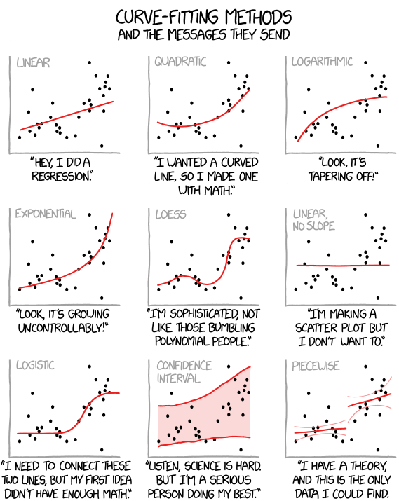

layout: true

<div class="my-footer">
  <span style="text-align:center">
    <span> 
      
    </span>
    <a href="https://therbootcamp.github.io/">
      <span style="padding-left:82px"> 
        <font color="#7E7E7E">
          www.therbootcamp.com
        </font>
      </span>
    </a>
    <a href="https://therbootcamp.github.io/">
      <font color="#7E7E7E">
      Applied Machine Learning with R @ AMLD  | November 2021
      </font>
    </a>
    </span>
  </div> 

---


```{r setup, include=FALSE}
options(htmltools.dir.version = FALSE)
# see: https://github.com/yihui/xaringan
# install.packages("xaringan")
# see: 
# https://github.com/yihui/xaringan/wiki
# https://github.com/gnab/remark/wiki/Markdown
options(width=110)
options(digits = 4)

# Get color palette functions

source("https://raw.githubusercontent.com/therbootcamp/ML_2019Oct/master/_materials/code/baselrbootcamp_palettes.R")
```


```{r, echo = FALSE ,message = FALSE, warning = FALSE}

knitr::opts_chunk$set(comment=NA, fig.width=6, fig.height=6, echo = TRUE, eval = TRUE, 
                      message = FALSE, warning = FALSE, fig.align = 'center', dpi = 200)
library(tidyverse)
library(ggthemes)
library(ggpubr)
library(tidymodels)
tidymodels_prefer()
library(ISLR)

baselers <- read_csv("1_Data/baselers.csv") %>% 
  mutate(eyecor = factor(eyecor, levels = c("yes", "no")))

set.seed(102)
x <- rnorm(10)
y <- .7 * x + rnorm(10, sd = .3) + 2

data <- data.frame(x, y)

mod <- lm(y ~ x, data = data)

great_intercept <- mod$coefficients[1]
great_slope <- mod$coefficients[2]

bad_intercept <- 3.5
bad_slope <- -.5

x0 = x
x1 = x
y0 = y
y1 = great_intercept + great_slope * x

yhat_regression  = y1

dat_great <- data.frame(x0, x1, y0, y1)

x0 = x
x1 = x
y0 = y
y1 = bad_intercept + bad_slope * x

dat_bad <- data.frame(x0, x1, y0, y1)

library(tidyverse)

raw <- ggplot(dat_great, aes(x = x0, y = y0)) + geom_point(col = baselrbootcamp_cols("grey"), size = 2) +
  theme_minimal() +
  xlim(c(-2, 3)) +
  ylim(c(0, 5)) +
  labs(title = "Raw Data", 
       x = "Feature", y = "Criterion")

great_raw <- ggplot(dat_great, aes(x = x0, y = y0)) + geom_point(col = baselrbootcamp_cols("grey"), size = 2) +
  geom_abline(slope = great_slope, intercept = great_intercept, size = .5, linetype = 3) +
  theme_minimal() +
  xlim(c(-2, 3)) +
  ylim(c(0, 5)) +
  labs(title = "Model B", 
              subtitle = paste0("B0 = ", round(great_intercept, 2), ", B1 = ", round(great_slope, 2)),

       x = "Feature", y = "Criterion")

bad_raw <- ggplot(dat_bad, aes(x = x0, y = y0)) + geom_point(col = baselrbootcamp_cols("grey")) +
  geom_abline(slope = bad_slope, intercept = bad_intercept, size = .5, linetype = 3) +
  theme_minimal() +
  xlim(c(-2, 3)) +
  ylim(c(0, 5)) +
   labs(title = "Model A", 
        subtitle = paste0("B0 = ", round(bad_intercept, 2), ", B1 = ", round(bad_slope, 2)),
       x = "Feature", y = "Criterion")

great_err <- great_raw + 
  geom_linerange(data = dat_great, aes(x = x0, ymin = y0, ymax = y1), col = baselrbootcamp_cols("magenta")) +
  geom_point(data = dat_great, aes(x = x0, y = y1, size = 2), col = baselrbootcamp_cols("green"), pch = "X", size = 4) +
    labs(title = "Model B",
       x = "Feature", y = "Criterion")

bad_err <- bad_raw +
    geom_linerange(data = dat_bad, aes(x = x0, ymin = y0, ymax = y1), col = baselrbootcamp_cols("magenta")) +
    geom_point(data = dat_bad, aes(x = x0, y = y1, size = 2), col = baselrbootcamp_cols("green"), pch = "X", size = 4) +
   labs(title = "Model A",
       x = "Feature", y = "Criterion")


set.seed(103)
x <- rnorm(10)
y <- round(1 / (1 + exp(rnorm(10,0,1)+x-1)))

data <- data.frame(x, y)
mod <- glm(y ~ x, data = data, family='binomial')

great_intercept <- mod$coefficients[1]
great_slope <- mod$coefficients[2]

x0 = x
x1 = x
y0 = y
y1 = 1/(1+exp(-(great_intercept + great_slope * x)))

dat_great <- data.frame(x0, x1, y0, y1)


logreg1 = ggplot(dat_great, aes(x = x0, y = y0)) + geom_point(col = baselrbootcamp_cols("grey"), size = 2) +
  theme_minimal() +
  labs(x = "Feature", y = "Criterion")

logreg2 = logreg1 + 
  geom_line(aes(x0,y1), size = .5, linetype = 3) +
  geom_linerange(data = dat_great, aes(x = x0, ymin = y0, ymax = y1), col = baselrbootcamp_cols("magenta")) +
  geom_point(data = dat_great, aes(x = x0, y = y1, size = 2), col = baselrbootcamp_cols("green"), pch = "X", size = 4) 

```


.pull-left45[

# Fitting

<p style="padding-top:1px"></p>

<ul>
  <li class="m1"><span>Models are actually <high>families of models</high>, with every parameter combination specifying a different model.</span></li>
  <li class="m2"><span>To fit a model means to <high>identify</high> from the family of models <high>the specific model that fits the data best</high>.</span></li>
</ul>

 
]

.pull-right45[

<br><br>

<p align = "center">
<br>
<font style="font-size:10px">adapted from <a href="https://www.explainxkcd.com/wiki/index.php/2048:_Curve-Fitting">explainxkcd.com</a></font>
</p>

]

---

# Which of these models is better? Why?

```{r, echo = FALSE, fig.width = 6, fig.height = 3, dpi = 300, out.width = "90%"}
ggarrange(bad_raw, great_raw, ncol = 2, nrow = 1)
```


---

# Which of these models is better? Why?

```{r, echo = FALSE, fig.width = 6, fig.height = 3, dpi = 300, out.width = "90%"}
ggarrange(bad_err, great_err, ncol = 2, nrow = 1)
```


---

# Loss function

.pull-left45[

<ul>
  <li class="m1"><span>Possible <high>the most important concept</high> in statistics and machine learning.</span></li>
  <li class="m2"><span>The loss function defines some <high>summary of the errors committed by the model</high>.</span></li>
</ul>


<p style="padding-top:7px">

$$\Large Loss = f(Error)$$

<p style="padding-top:7px">

<table style="cellspacing:0; cellpadding:0; border:none;">
<tr>
  <td>
    <b>Purpose</b>
  </td>
  <td>
    <b>Description</b>
  </td>
</tr>
<tr>
  <td bgcolor="white">
    Fitting
  </td>
  <td bgcolor="white">
    Find parameters that minimize loss function.
  </td>
</tr>
<tr>
  <td>
    Evaluation
  </td>
  <td>
    Calculate loss function for fitted model.
  </td>
</tr>
</table>

]


.pull-right45[

```{r, echo = FALSE, fig.width = 3, fig.height = 3, dpi = 200, out.width = "90%"}
bad_err + labs(title=element_blank(),subtitle = element_blank())
```


]

---

class: center, middle

<high><h1>Regression</h1></high>

<font color = "gray"><h1>Decision Trees</h1></font>

<font color = "gray"><h1>Random Forests</h1></font>


---

# Regression

.pull-left45[

In [regression](https://en.wikipedia.org/wiki/Regression_analysis), the criterion $Y$ is modeled as the <high>sum</high> of <high>features</high> $X_1, X_2, ...$ <high>times weights</high> $\beta_1, \beta_2, ...$ plus $\beta_0$ the so-called the intercept.

<p style="padding-top:10px"></p>


$$\large \hat{Y} =  \beta_{0} + \beta_{1} \times X_1 + \beta_{2} \times X2 + ...$$

<p style="padding-top:10px"></p>

The weight $\beta_{i}$ indiciates the <high>amount of change</high> in $\hat{Y}$ for a change of 1 in $X_{i}$.

Ceteris paribus, the <high>more extreme</high> $\beta_{i}$, the <high>more important</high> $X_{i}$ for the prediction of $Y$ <font style="font-size:12px">(Note: the scale of $X_{i}$ matters too!).</font>

If $\beta_{i} = 0$, then $X_{i}$ <high>does not help</high> predicting $Y$


]

.pull-right45[

```{r, echo = FALSE, fig.width = 3, fig.height = 3, dpi = 200, out.width = "90%"}
bad_err + labs(title=element_blank(),subtitle = element_blank())
```


]


---

# Regression loss

.pull-left45[

<p>

<ul style="margin-bottom:-20px">
  <li class="m1"><span><b>Mean Squared Error (MSE)</b>
  <br><br>
  <ul class="level">
    <li><span>Average <high>squared distance</high> between predictions and true values.</span></li>
  </ul>
  </span></li>
</ul>

$$MSE = \frac{1}{n}\sum_{i \in 1,...,n}(Y_{i} - \hat{Y}_{i})^{2}$$

<ul>
  <li class="m2"><span><b>Mean Absolute Error (MAE)</b>
  <br><br>
  <ul class="level">
    <li><span>Average <high>absolute distance</high> between predictions and true values.</span></li>
  </ul>
  </span></li>
</ul>

$$ MAE = \frac{1}{n}\sum_{i \in 1,...,n} \lvert Y_{i} - \hat{Y}_{i} \rvert$$


</p>

]

.pull-right45[

```{r, echo = FALSE, fig.width = 3, fig.height = 3, dpi = 200, out.width = "90%"}
bad_err + labs(title=element_blank(),subtitle = element_blank())

```


]

---

# 2 types of supervised problems

.pull-left45[

<ul style="margin-bottom:-20px">
  <li class="m1"><span><b>Regression</b>
  <br><br>
  <ul class="level">
    <li><span>Regression problems involve the <high>prediction of a quantitative feature</high>.</span></li>
    <li><span>E.g., predicting the cholesterol level as a function of age</high>.</span></li>
  </ul>
  </span></li><br>
  <li class="m2"><span><b>Classification</b>
  <br><br>
  <ul class="level">
    <li><span>Classification problems involve the <high>prediction of a categorical feature</high>.</span></li>
    <li><span>E.g., predicting the type of chest pain as a function of age</high>.</span></li>
  </ul>
  </span></li>
</ul>


]

.pull-right4[

<p align = "center">
<br>
</p>

]

---

# Logistic regression

.pull-left45[

<ul style="margin-bottom:-20px">
  <li class="m1"><span>In <a href="https://en.wikipedia.org/wiki/Logistic_regression">logistic regression</a>, the class criterion <font style="font-size:22px"><mono>Y &isin; (0,1)</mono></font> is modeled also as the <high>sum of feature times weights</high>, but with the prediction being transformed using a <high>logistic link function</high>.</span></li>
</ul>

<p style="padding-top:10px"></p>

$$\large \hat{Y} =  Logistic(\beta_{0} + \beta_{1} \times X_1 + ...)$$

<p style="padding-top:10px"></p>

<ul style="margin-bottom:-20px">
  <li class="m2"><span>The logistic function <high>maps predictions to the range of 0 and 1</high>, the two class values..</span></li>
</ul>

<p style="padding-top:10px"></p>

$$ Logistic(x) = \frac{1}{1+exp(-x)}$$

]

.pull-right45[

```{r, echo = FALSE, fig.width = 3, fig.height = 3, dpi = 200, out.width = "90%"}
logreg1
```

]

---

# Logistic regression

.pull-left45[

<ul style="margin-bottom:-20px">
  <li class="m1"><span>In <a href="https://en.wikipedia.org/wiki/Logistic_regression">logistic regression</a>, the class criterion <font style="font-size:22px"><mono>Y &isin; (0,1)</mono></font> is modeled also as the <high>sum of feature times weights</high>, but with the prediction being transformed using a <high>logistic link function</high>.</span></li>
</ul>

<p style="padding-top:10px"></p>

$$\large \hat{Y} =  Logistic(\beta_{0} + \beta_{1} \times X_1 + ...)$$

<p style="padding-top:10px"></p>

<ul style="margin-bottom:-20px">
  <li class="m2"><span>The logistic function <high>maps predictions to the range of 0 and 1</high>, the two class values..</span></li>
</ul>

<p style="padding-top:10px"></p>

$$ Logistic(x) = \frac{1}{1+exp(-x)}$$

]

.pull-right45[

```{r, echo = FALSE, fig.width = 3, fig.height = 3, dpi = 200, out.width = "90%"}
logreg2
```

]

---

# Classification loss

.pull-left45[

<ul style="margin-bottom:-20px">
  <li class="m1"><span><b>Distance</b>
  <br><br>
  <ul class="level">
    <li><span>Logloss is <high>used to fit the parameters</high>, alternative distance measures are MSE and MAE.</span></li>
  </ul>
  </span></li>
</ul>

$$\small LogLoss = -\frac{1}{n}\sum_{i}^{n}(log(\hat{y})y+log(1-\hat{y})(1-y))$$

<ul> 
  <li class="m2"><span><b>Overlap</b>
  <br><br>
  <ul class="level">
    <li><span>Does the <high>predicted class match the actual class</high>. Often preferred for <high>ease of interpretation</high>..</span></li>
  </ul>
  </span></li>
</ul>

$$\small  Loss_{01} = 1-Accuracy = \frac{1}{n}\sum_i^n I(y \neq \lfloor \hat{y} \rceil)$$

]

.pull-right45[

```{r, echo = FALSE, fig.width = 3, fig.height = 3, dpi = 200, out.width = "90%"}
logreg2
```

]


---

class: center,  middle

<br><br>

# Fitting regression models with `tidymodels`

```{r, echo = FALSE, out.width = "30%"}
knitr::include_graphics("image/tidymodels.svg")
```

---

# 5 Steps to fit a model in `tidymodels`

.pull-left45[

<ul>
  <li class="m1"><span>Define the <mono>recipe</mono>.</span></li>
  <li class="m2"><span>Define the model.</span></li>
  <li class="m3"><span>Define the <mono>workflow</mono>.</span></li>
  <li class="m4"><span>Fit the <mono>workflow</mono></span></li>
  <li class="m5"><span>Assess model performance.</span></li>
</ul>

]

.pull-right45[
```{r, echo = FALSE, out.width = "90%"}

```

]

---

# Step 1: Define the <mono>recipe</mono>

.pull-left45[

The <mono>recipe</mono> specifies two things: 
<ul>
  <li class="m1"><span>The criterion and the features, i.e., the <mono>formula</mono> to use.</span></li>
  <li class="m2"><span>How the features should be pre-processed before the model fitting.</span></li>
</ul>

<br>

To set up a <mono>recipe</mono>:
<ul>
  <li class="m1"><span>Initialize it with <mono>recipe()</mono>, wherein the formula and data are specified.</span></li>
  <li class="m2"><span>Add pre-processing steps, using <mono>step_*()</mono> functions and <mono>dplyr</mono>-like selectors.</span></li>
</ul>
]

.pull-right45[

```{r, echo = TRUE, out.width = "90%", eval = TRUE, warning = FALSE}
# set up recipe for regression model
lm_recipe <- 
  recipe(income ~ ., data = baselers) %>% 
  step_dummy(all_nominal_predictors())

lm_recipe
```

]

---

# Step 2: Define the model

.pull-left45[

The model specifies: 
<ul>
  <li class="m1"><span>Which model (e.g. linear regression) to use.</span></li>
  <li class="m2"><span>Which engine (underlying model-fitting algorithm) to use.</span></li>
  <li class="m3"><span>The problem mode, i.e., <high>regression vs. classification</high>.</span></li>
</ul>

<br>

To set up a model:
<ul>
  <li class="m1"><span>Specify the model, e.g., using <mono>linear_reg()</mono> or <mono>logistic_reg()</mono>.</span></li>
  <li class="m2"><span>Specify the engine using <mono>set_engine()</mono>.</span></li>
  <li class="m3"><span>Specify the problem mode using <mono>set_mode()</mono>.</span></li>
</ul>
]

.pull-right45[

```{r, echo = TRUE, out.width = "90%", eval = TRUE, warning = FALSE}
# set up model for regression model
lm_model <- 
  linear_reg() %>% 
  set_engine("lm") %>% 
  set_mode("regression")

lm_model
```

]

---

# Step 3: Define the <mono>workflow</mono>

.pull-left45[

A <mono>workflow</mono> combines the recipe and model and facilitates fitting the model. 
To set up a <mono>workflow</mono>:
<ul>
  <li class="m1"><span>Initialize it using the <mono>workflow()</mono> function.</span></li>
  <li class="m2"><span>Add a recipe using <mono>add_recipe()</mono>.</span></li>
  <li class="m3"><span>Add a model using <mono>add_model()</mono>.</span></li>
</ul>
]

.pull-right45[

```{r, echo = TRUE, out.width = "90%", eval = TRUE, warning = FALSE}
# set up workflow for regression model
lm_workflow <- 
  workflow() %>% 
  add_recipe(lm_recipe) %>% 
  add_model(lm_model)

lm_workflow
```

]

---

# Step 4: Fit the <mono>workflow</mono>

.pull-left35[

A <mono>workflow</mono> is fitted using the <mono>fit()</mono> function. This will:
<ul>
  <li class="m1"><span>Apply the recipe with the pre-processing steps.</span></li>
  <li class="m2"><span>Run the specified algorithm (i.e., model).</span></li>
</ul>
]

.pull-right55[

```{r, echo = TRUE, out.width = "90%", eval = TRUE, warning = FALSE}
# fit the workflow
income_lm <- fit(lm_workflow,
                 data = baselers)

tidy(income_lm)
```

]

---

# Step 5: Assess model fit

.pull-left45[

<ul>
  <li class="m1"><span>Use <mono>predict()</mono> to obtain model predictions on specified data.</span></li>
  <li class="m2"><span>Use <mono>metrics()</mono> to obtain performance metrics, suited for the current problem mode.</span></li>
</ul>
]

.pull-right45[

```{r, echo = TRUE, out.width = "90%", eval = TRUE, warning = FALSE}
# generate predictions
lm_pred <-
  income_lm %>% 
  predict(baselers) %>% 
  bind_cols(baselers %>% select(income))

metrics(lm_pred, truth = income,
        estimate = .pred)
```

]

---

# Logistic regression model example

.pull-left45[

<ul>
  <li class="m1"><span>Define the <mono>recipe</mono>.</span></li>
  <li class="m2"><span>Define the model.</span></li>
  <li class="m3"><span>Define the <mono>workflow</mono>.</span></li>
  <li class="m4"><span>Fit the <mono>workflow</mono>.</span></li>
  <li class="m5"><span>Assess model performance.</span></li>
</ul>
]

.pull-right45[

```{r, echo = TRUE, out.width = "90%", eval = TRUE, warning = FALSE}
# generate predictions
lm_pred <-
  income_lm %>% 
  predict(baselers) %>% 
  bind_cols(baselers %>% select(income))

metrics(lm_pred, truth = income,
        estimate = .pred)
```

]

---

# Logistic regression model example

.pull-left45[

<ul>
  <li class="m1"><span><high>Define the <mono>recipe</mono>.</high></span></li>
  <li class="m2"><span>Define the model.</span></li>
  <li class="m3"><span>Define the <mono>workflow</mono>.</span></li>
  <li class="m4"><span>Fit the <mono>workflow</mono>.</span></li>
  <li class="m5"><span>Assess model performance.</span></li>
</ul>
]

.pull-right45[

```{r, echo = TRUE, out.width = "90%", eval = TRUE, warning = FALSE}
logistic_recipe <- 
  recipe(eyecor ~., data = baselers) %>% 
  step_dummy(all_nominal_predictors())
```

]

---

# Logistic regression model example

.pull-left45[

<ul>
  <li class="m1"><span>Define the <mono>recipe</mono>.</span></li>
  <li class="m2"><span><high>Define the model.</high></span></li>
  <li class="m3"><span>Define the <mono>workflow</mono>.</span></li>
  <li class="m4"><span>Fit the <mono>workflow</mono>.</span></li>
  <li class="m5"><span>Assess model performance.</span></li>
</ul>
]

.pull-right45[

```{r, echo = TRUE, out.width = "90%", eval = TRUE, warning = FALSE}
logistic_model <- 
  logistic_reg() %>% 
  set_engine("glm") %>% 
  set_mode("classification")
```

]

---

# Logistic regression model example

.pull-left45[

<ul>
  <li class="m1"><span>Define the <mono>recipe</mono>.</span></li>
  <li class="m2"><span>Define the model.</span></li>
  <li class="m3"><span><high>Define the <mono>workflow</mono>.</high></span></li>
  <li class="m4"><span>Fit the <mono>workflow</mono>.</span></li>
  <li class="m5"><span>Assess model performance.</span></li>
</ul>
]

.pull-right45[

```{r, echo = TRUE, out.width = "90%", eval = TRUE, warning = FALSE}
logistic_workflow <- 
  workflow() %>% 
  add_recipe(logistic_recipe) %>% 
  add_model(logistic_model)
```

]

---

# Logistic regression model example

.pull-left45[

<ul>
  <li class="m1"><span>Define the <mono>recipe</mono>.</span></li>
  <li class="m2"><span>Define the model.</span></li>
  <li class="m3"><span>Define the <mono>workflow</mono>.</span></li>
  <li class="m4"><span><high>Fit the <mono>workflow</mono>.</high></span></li>
  <li class="m5"><span>Assess model performance.</span></li>
</ul>
]

.pull-right45[

```{r, echo = TRUE, out.width = "90%", eval = TRUE, warning = FALSE}
eyecor_glm <- fit(logistic_workflow,
                  data = baselers)
```

]

---

# Logistic regression model example

.pull-left4[

<ul>
  <li class="m1"><span>Define the <mono>recipe</mono>.</span></li>
  <li class="m2"><span>Define the model.</span></li>
  <li class="m3"><span>Define the <mono>workflow</mono>.</span></li>
  <li class="m4"><span>Fit the <mono>workflow</mono>.</span></li>
  <li class="m5"><span><high>Assess model performance.</high></span></li>
</ul>
]

.pull-right5[

```{r, echo = TRUE, out.width = "90%", eval = TRUE, warning = FALSE}
logistic_pred <- 
  predict(eyecor_glm, baselers,
          type = "prob") %>% 
  bind_cols(predict(eyecor_glm, baselers)) %>% 
  bind_cols(baselers %>% select(eyecor))

metrics(logistic_pred, truth = eyecor,
        estimate = .pred_class, .pred_yes)
```

]

---

# Logistic regression model example

.pull-left4[

<ul>
  <li class="m1"><span>Define the <mono>recipe</mono>.</span></li>
  <li class="m2"><span>Define the model.</span></li>
  <li class="m3"><span>Define the <mono>workflow</mono>.</span></li>
  <li class="m4"><span>Fit the <mono>workflow</mono>.</span></li>
  <li class="m5"><span><high>Assess model performance.</high></span></li>
</ul>
]

.pull-right5[

```{r, echo = TRUE, out.width = "90%", eval = TRUE, warning = FALSE, fig.height = 4, dpi = 300}
logistic_pred %>% 
  roc_curve(truth = eyecor, .pred_yes) %>% 
  autoplot()
```

]

---

class: middle, center

<h1><a href=https://therbootcamp.github.io/AML_2021AMLD/_sessions/Fitting/Fitting_practical.html>Practical</a></h1>


