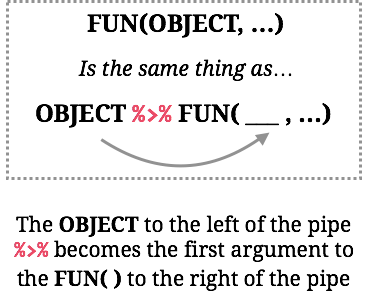

layout: true

<div class="my-footer">
  <span style="text-align:center">
    <span> 
      
    </span>
    <a href="https://therbootcamp.github.io/">
      <span style="padding-left:82px"> 
        <font color="#7E7E7E">
          www.therbootcamp.com
        </font>
      </span>
    </a>
    <a href="https://therbootcamp.github.io/">
      <font color="#7E7E7E">
      Applied Machine Learning with R @ AMLD  | November 2021
      </font>
    </a>
    </span>
  </div> 

---

```{r, eval = TRUE, echo = FALSE, warning=F,message=F}
# Code to knit slides
baselers <- readr::read_csv("data/baselers.csv")
```

```{r setup, include=FALSE}
options(htmltools.dir.version = FALSE)
# see: https://github.com/yihui/xaringan
# install.packages("xaringan")
# see: 
# https://github.com/yihui/xaringan/wiki
# https://github.com/gnab/remark/wiki/Markdown
options(width=110)
options(digits = 4)

require(tidyverse)
```


# 11 basic R lessons

.pull-left4[

<ul>
  <li class="m1"><span>The assignment operator <mono><-</mono></span></li>
  <li class="m2"><span><mono><-</mono> creates/changes objects</span></li>
  <li class="m3"><span>Everythings happens through functions</span></li>
  <li class="m4"><span>Functions have (default) arguments</span></li>
  <li class="m5"><span>Arguments expect classes</span></li>
  <li class="m6"><span>Find help using <mono>?</mono></span></li>
  <li class="m7"><span>Chain functions with the pipe</span></li>
  <li class="m8"><span>Functions exist in Packages</span></li>
  <li class="m9"><span>Data lives in data frames</span></li>  
  <li class="m10"><span>Three+ data types</span></li>  
  <li class="m11"><span>Formulae</span></li>  
</ul>

]

---

# 11 basic R lessons

.pull-left4[

<ul>
  <li class="m1"><span><high>The assignment operator <mono><-</mono></high></span></li>
  <li class="m2g"><span><mono><-</mono> creates/changes objects</span></li>
  <li class="m3g"><span>Everythings happens through functions</span></li>
  <li class="m4g"><span>Functions have (default) arguments</span></li>
  <li class="m5g"><span>Arguments expect classes</span></li>
  <li class="m6g"><span>Find help using <mono>?</mono></span></li>
  <li class="m7g"><span>Chain functions with the pipe</span></li>
  <li class="m8g"><span>Functions exist in Packages</span></li>
  <li class="m9g"><span>Data lives in data frames</span></li>  
  <li class="m10g"><span>Three+ data types</span></li>  
  <li class="m11g"><span>Formulae</span></li>  
</ul>

]

.pull-right5[

<br>

<p align="center">
  
</p>


]


---

# 11 basic R lessons

.pull-left4[

<ul>
  <li class="m1g"><span>The assignment operator <mono><-</mono></span></li>
  <li class="m2"><span><high><mono><-</mono> creates/changes objects</high></span></li>
  <li class="m3g"><span>Everythings happens through functions</span></li>
  <li class="m4g"><span>Functions have (default) arguments</span></li>
  <li class="m5g"><span>Arguments expect classes</span></li>
  <li class="m6g"><span>Find help using <mono>?</mono></span></li>
  <li class="m7g"><span>Chain functions with the pipe</span></li>
  <li class="m8g"><span>Functions exist in Packages</span></li>
  <li class="m9g"><span>Data lives in data frames</span></li>  
  <li class="m10g"><span>Three+ data types</span></li>  
  <li class="m11g"><span>Formulae</span></li>  
</ul>

]


.pull-right5[
```{r}
# An object called one_two_three
one_two_three <- c(1, 2, 3)

# Print the object
print(one_two_three)

# Print the object
one_two_three

```
]

---

# 11 basic R lessons

.pull-left4[

<ul>
  <li class="m1g"><span>The assignment operator <mono><-</mono></span></li>
  <li class="m2"><span><high><mono><-</mono> creates/changes objects</high></span></li>
  <li class="m3g"><span>Everythings happens through functions</span></li>
  <li class="m4g"><span>Functions have (default) arguments</span></li>
  <li class="m5g"><span>Arguments expect classes</span></li>
  <li class="m6g"><span>Find help using <mono>?</mono></span></li>
  <li class="m7g"><span>Chain functions with the pipe</span></li>
  <li class="m8g"><span>Functions exist in Packages</span></li>
  <li class="m9g"><span>Data lives in data frames</span></li>  
  <li class="m10g"><span>Three+ data types</span></li>  
  <li class="m11g"><span>Formulae</span></li> 
</ul>

]


.pull-right5[
```{r}
# An object called one_two_three
one_two_three <- c(1, 2, 3)

# Calculate arithmetic mean
mean(one_two_three)
```

]

---

# 11 basic R lessons

.pull-left4[

<ul>
  <li class="m1g"><span>The assignment operator <mono><-</mono></span></li>
  <li class="m2"><span><high><mono><-</mono> creates/changes objects</high></span></li>
  <li class="m3g"><span>Everythings happens through functions</span></li>
  <li class="m4g"><span>Functions have (default) arguments</span></li>
  <li class="m5g"><span>Arguments expect classes</span></li>
  <li class="m6g"><span>Find help using <mono>?</mono></span></li>
  <li class="m7g"><span>Chain functions with the pipe</span></li>
  <li class="m8g"><span>Functions exist in Packages</span></li>
  <li class="m9g"><span>Data lives in data frames</span></li>  
  <li class="m10g"><span>Three+ data types</span></li>  
  <li class="m11g"><span>Formulae</span></li> 
</ul>

]


.pull-right5[
```{r}
# An object called one_two_three
one_two_three <- c(1, 2, 3)

# Calculate arithmetic mean
result <- mean(one_two_three)

# Use the result
result * 10
```

]

---

# 11 basic R lessons

.pull-left4[

<ul>
  <li class="m1g"><span>The assignment operator <mono><-</mono></span></li>
  <li class="m2"><span><high><mono><-</mono> creates/changes objects</high></span></li>
  <li class="m3g"><span>Everythings happens through functions</span></li>
  <li class="m4g"><span>Functions have (default) arguments</span></li>
  <li class="m5g"><span>Arguments expect classes</span></li>
  <li class="m6g"><span>Find help using <mono>?</mono></span></li>
  <li class="m7g"><span>Chain functions with the pipe</span></li>
  <li class="m8g"><span>Functions exist in Packages</span></li>
  <li class="m9g"><span>Data lives in data frames</span></li>  
  <li class="m10g"><span>Three+ data types</span></li>  
  <li class="m11g"><span>Formulae</span></li> 
</ul>

]


.pull-right5[
```{r}
# An object called one_two_three
one_two_three <- c(1, 2, 3)

# Print the object
one_two_three

# Add 100
one_two_three + 100

# Print the object
one_two_three

```

]

---

# 11 basic R lessons

.pull-left4[

<ul>
  <li class="m1g"><span>The assignment operator <mono><-</mono></span></li>
  <li class="m2"><span><high><mono><-</mono> creates/changes objects</high></span></li>
  <li class="m3g"><span>Everythings happens through functions</span></li>
  <li class="m4g"><span>Functions have (default) arguments</span></li>
  <li class="m5g"><span>Arguments expect classes</span></li>
  <li class="m6g"><span>Find help using <mono>?</mono></span></li>
  <li class="m7g"><span>Chain functions with the pipe</span></li>
  <li class="m8g"><span>Functions exist in Packages</span></li>
  <li class="m9g"><span>Data lives in data frames</span></li>  
  <li class="m10g"><span>Three+ data types</span></li>  
  <li class="m11g"><span>Formulae</span></li>   
</ul>

]


.pull-right5[
```{r}
# An object called one_two_three
one_two_three <- c(1, 2, 3)

# Print the object
one_two_three

# Add 100 and re-assign
one_two_three <- one_two_three + 100

# Print the object
one_two_three

```

]


---

# 11 basic R lessons

.pull-left4[

<ul>
  <li class="m1g"><span>The assignment operator <mono><-</mono></span></li>
  <li class="m2g"><span><mono><-</mono> creates/changes objects</high></span></li>
  <li class="m3"><span><high>Everythings happens through functions</high></span></li>
  <li class="m4g"><span>Functions have (default) arguments</span></li>
  <li class="m5g"><span>Arguments expect classes</span></li>
  <li class="m6g"><span>Find help using <mono>?</mono></span></li>
  <li class="m7g"><span>Chain functions with the pipe</span></li>
  <li class="m8g"><span>Functions exist in Packages</span></li>
  <li class="m9g"><span>Data lives in data frames</span></li>  
  <li class="m10g"><span>Three+ data types</span></li>  
  <li class="m11g"><span>Formulae</span></li>  
</ul>

]


.pull-right5[

<br><br>

<p align="center"></p>
]

---

# 11 basic R lessons

.pull-left4[

<ul>
  <li class="m1g"><span>The assignment operator <mono><-</mono></span></li>
  <li class="m2g"><span><mono><-</mono> creates/changes objects</high></span></li>
  <li class="m3"><span><high>Everythings happens through functions</high></span></li>
  <li class="m4g"><span>Functions have (default) arguments</span></li>
  <li class="m5g"><span>Arguments expect classes</span></li>
  <li class="m6g"><span>Find help using <mono>?</mono></span></li>
  <li class="m7g"><span>Chain functions with the pipe</span></li>
  <li class="m8g"><span>Functions exist in Packages</span></li>
  <li class="m9g"><span>Data lives in data frames</span></li>  
  <li class="m10g"><span>Three+ data types</span></li>  
  <li class="m11g"><span>Formulae</span></li> 
</ul>

]


.pull-right5[
```{r}
# Function c()
one_two_three <- c(1, 2, 3)

# Function `+`()
one_two_three + 100

# Function print()
one_two_three

# Function mean()
mean(one_two_three)

```
]

---

# 11 basic R lessons

.pull-left4[

<ul>
  <li class="m1g"><span>The assignment operator <mono><-</mono></span></li>
  <li class="m2g"><span><mono><-</mono> creates/changes objects</high></span></li>
  <li class="m3g"><span>Everythings happens through functions</span></li>
  <li class="m4"><span><high>Functions have (default) arguments</high></span></li>
  <li class="m5g"><span>Arguments expect classes</span></li>
  <li class="m6g"><span>Find help using <mono>?</mono></span></li>
  <li class="m7g"><span>Chain functions with the pipe</span></li>
  <li class="m8g"><span>Functions exist in Packages</span></li>
  <li class="m9g"><span>Data lives in data frames</span></li>  
  <li class="m10g"><span>Three+ data types</span></li>  
  <li class="m11g"><span>Formulae</span></li>  
</ul>

]


.pull-right5[
```{r, error=TRUE,tidy=T}
# No argument
mean()

# One (necessary) argument
mean(c(1, 2, 3))

# Add a missing value
mean(c(1, 2, 3, NA))

```
]

---

# 11 basic R lessons

.pull-left4[

<ul>
  <li class="m1g"><span>The assignment operator <mono><-</mono></span></li>
  <li class="m2g"><span><mono><-</mono> creates/changes objects</high></span></li>
  <li class="m3g"><span>Everythings happens through functions</span></li>
  <li class="m4"><span><high>Functions have (default) arguments</high></span></li>
  <li class="m5g"><span>Arguments expect classes</span></li>
  <li class="m6g"><span>Find help using <mono>?</mono></span></li>
  <li class="m7g"><span>Chain functions with the pipe</span></li>
  <li class="m8g"><span>Functions exist in Packages</span></li>
  <li class="m9g"><span>Data lives in data frames</span></li>  
  <li class="m10g"><span>Three+ data types</span></li>  
  <li class="m11g"><span>Formulae</span></li> 
</ul>

]

.pull-right5[
```{r, error=TRUE,tidy=T}
# No argument
mean()

# One (necessary) argument
mean(c(1, 2, 3))

# Change the default to handle missing
mean(c(1, 2, 3, NA), na.rm = TRUE)

```
]


---

# 11 basic R lessons

.pull-left4[

<ul>
  <li class="m1g"><span>The assignment operator <mono><-</mono></span></li>
  <li class="m2g"><span><mono><-</mono> creates/changes objects</high></span></li>
  <li class="m3g"><span>Everythings happens through functions</span></li>
  <li class="m4"><span><high>Functions have (default) arguments</high></span></li>
  <li class="m5g"><span>Arguments expect classes</span></li>
  <li class="m6g"><span>Find help using <mono>?</mono></span></li>
  <li class="m7g"><span>Chain functions with the pipe</span></li>
  <li class="m8g"><span>Functions exist in Packages</span></li>
  <li class="m9g"><span>Data lives in data frames</span></li>  
  <li class="m10g"><span>Three+ data types</span></li>  
  <li class="m11g"><span>Formulae</span></li> 
</ul>

]


.pull-right5[
```{r, error=TRUE,tidy=T}
# Mean of c(1, 2, 3)
mean(c(1, 2, 3))

# Mean of c("1", "2", "3")
mean(c("1", "2", "3"))
```
]

---

# 11 basic R lessons

.pull-left4[

<ul>
  <li class="m1g"><span>The assignment operator <mono><-</mono></span></li>
  <li class="m2g"><span><mono><-</mono> creates/changes objects</high></span></li>
  <li class="m3g"><span>Everythings happens through functions</span></li>
  <li class="m4g"><span>Functions have (default) arguments</span></li>
  <li class="m5"><span><high>Arguments expect classes</high></span></li>
  <li class="m6g"><span>Find help using <mono>?</mono></span></li>
  <li class="m7g"><span>Chain functions with the pipe</span></li>
  <li class="m8g"><span>Functions exist in Packages</span></li>
  <li class="m9g"><span>Data lives in data frames</span></li>  
  <li class="m10g"><span>Three+ data types</span></li>  
  <li class="m11g"><span>Formulae</span></li>  
</ul>

]


.pull-right5[
```{r, error=TRUE,tidy=T}
# Class of c(1, 2, 3)
class(c(1, 2, 3))

# Class of c("1", "2", "3")
class(c("1", "2", "3"))
```
]

---

# 11 basic R lessons

.pull-left4[


<ul>
  <li class="m1g"><span>The assignment operator <mono><-</mono></span></li>
  <li class="m2g"><span><mono><-</mono> creates/changes objects</high></span></li>
  <li class="m3g"><span>Everythings happens through functions</span></li>
  <li class="m4g"><span>Functions have (default) arguments</span></li>
  <li class="m5g"><span>Arguments expect classes</span></li>
  <li class="m6"><span><high>Find help using <mono>?</mono></high></span></li>
  <li class="m7g"><span>Chain functions with the pipe</span></li>
  <li class="m8g"><span>Functions exist in Packages</span></li>
  <li class="m9g"><span>Data lives in data frames</span></li>  
  <li class="m10g"><span>Three+ data types</span></li>  
  <li class="m11g"><span>Formulae</span></li> 
</ul>

]


.pull-right5[
```{r, message = F, warnings = F}
?mean
```
<p align="center"></p>
]

---

# 11 basic R lessons

.pull-left4[


<ul>
  <li class="m1g"><span>The assignment operator <mono><-</mono></span></li>
  <li class="m2g"><span><mono><-</mono> creates/changes objects</high></span></li>
  <li class="m3g"><span>Everythings happens through functions</span></li>
  <li class="m4g"><span>Functions have (default) arguments</span></li>
  <li class="m5g"><span>Arguments expect classes</span></li>
  <li class="m6"><span><high>Find help using <mono>?</mono></high></span></li>
  <li class="m7g"><span>Chain functions with the pipe</span></li>
  <li class="m8g"><span>Functions exist in Packages</span></li>
  <li class="m9g"><span>Data lives in data frames</span></li>  
  <li class="m10g"><span>Three+ data types</span></li>  
  <li class="m11g"><span>Formulae</span></li> 
</ul>

]


.pull-right5[
```{r}
?mean
```
<p align="center"></p>
]

---

# 11 basic R lessons

.pull-left4[


<ul>
  <li class="m1g"><span>The assignment operator <mono><-</mono></span></li>
  <li class="m2g"><span><mono><-</mono> creates/changes objects</high></span></li>
  <li class="m3g"><span>Everythings happens through functions</span></li>
  <li class="m4g"><span>Functions have (default) arguments</span></li>
  <li class="m5g"><span>Arguments expect classes</span></li>
  <li class="m6"><span><high>Find help using <mono>?</mono></high></span></li>
  <li class="m7g"><span>Chain functions with the pipe</span></li>
  <li class="m8g"><span>Functions exist in Packages</span></li>
  <li class="m9g"><span>Data lives in data frames</span></li>  
  <li class="m10g"><span>Three+ data types</span></li>  
  <li class="m11g"><span>Formulae</span></li> 
</ul>

]


.pull-right5[
```{r}
# Mean of c(1, 2, 3)
mean(c(1, 2, 3))

# Mean of c(TRUE, FALSE, TRUE)
mean(c(TRUE, FALSE, TRUE))

# Mean of c("1", "2", "3")
mean(c("1", "2", "3"))
```

]

---

# 11 basic R lessons

.pull-left4[


<ul>
  <li class="m1g"><span>The assignment operator <mono><-</mono></span></li>
  <li class="m2g"><span><mono><-</mono> creates/changes objects</high></span></li>
  <li class="m3g"><span>Everythings happens through functions</span></li>
  <li class="m4g"><span>Functions have (default) arguments</span></li>
  <li class="m5g"><span>Arguments expect classes</span></li>
  <li class="m6g"><span>Find help using <mono>?</mono></span></li>
  <li class="m7"><span><high>Chain functions with the pipe</high></span></li>
  <li class="m8g"><span>Functions exist in Packages</span></li>
  <li class="m9g"><span>Data lives in data frames</span></li>  
  <li class="m10g"><span>Three+ data types</span></li>  
  <li class="m11g"><span>Formulae</span></li> 
</ul>

]

.pull-right5[
```{r}
# 
score <- c(8, 4, 6, 3, 7, 3)
score

# Mittelwert: Base-R-style
mean(score)

# Mittelwert: dplyr-style
score %>%  
  mean()  
```

]

---

# 11 basic R lessons

.pull-left4[


<ul>
  <li class="m1g"><span>The assignment operator <mono><-</mono></span></li>
  <li class="m2g"><span><mono><-</mono> creates/changes objects</high></span></li>
  <li class="m3g"><span>Everythings happens through functions</span></li>
  <li class="m4g"><span>Functions have (default) arguments</span></li>
  <li class="m5g"><span>Arguments expect classes</span></li>
  <li class="m6g"><span>Find help using <mono>?</mono></span></li>
  <li class="m7"><span><high>Chain functions with the pipe</high></span></li>
  <li class="m8g"><span>Functions exist in Packages</span></li>
  <li class="m9g"><span>Data lives in data frames</span></li>  
  <li class="m10g"><span>Three+ data types</span></li>  
  <li class="m11g"><span>Formulae</span></li> 
</ul>

]

.pull-right5[
```{r}
# 
score <- c(8, 4, 6, 3, 7, 3)
score

# Mittelwert: Base-R-style
round(mean(score), 2)

# Mittelwert: dplyr-style
score %>%  
  mean() %>% 
  round(2)
```

]


---

# 11 basic R lessons

.pull-left4[


<ul>
  <li class="m1g"><span>The assignment operator <mono><-</mono></span></li>
  <li class="m2g"><span><mono><-</mono> creates/changes objects</high></span></li>
  <li class="m3g"><span>Everythings happens through functions</span></li>
  <li class="m4g"><span>Functions have (default) arguments</span></li>
  <li class="m5g"><span>Arguments expect classes</span></li>
  <li class="m6g"><span>Find help using <mono>?</mono></span></li>
  <li class="m7"><span><high>Chain functions with the pipe</high></span></li>
  <li class="m8g"><span>Functions exist in Packages</span></li>
  <li class="m9g"><span>Data lives in data frames</span></li>  
  <li class="m10g"><span>Three+ data types</span></li>  
  <li class="m11g"><span>Formulae</span></li> 
</ul>

]

.pull-right5[
<p align="center"></p>
]


---

# 11 basic R lessons

.pull-left4[

<ul>
  <li class="m1g"><span>The assignment operator <mono><-</mono></span></li>
  <li class="m2g"><span><mono><-</mono> creates/changes objects</high></span></li>
  <li class="m3g"><span>Everythings happens through functions</span></li>
  <li class="m4g"><span>Functions have (default) arguments</span></li>
  <li class="m5g"><span>Arguments expect classes</span></li>
  <li class="m6g"><span>Find help using <mono>?</mono></span></li>
  <li class="m7g"><span>Chain functions with the pipe</span></li>
  <li class="m8"><span><high>Functions exist in Packages</high></span></li>
  <li class="m9g"><span>Data lives in data frames</span></li>  
  <li class="m10g"><span>Three+ data types</span></li>  
  <li class="m11g"><span>Formulae</span></li> 
</ul>

]


.pull-right5[
<p align="center"></p>
]

---

# 11 basic R lessons

.pull-left4[


<ul>
  <li class="m1g"><span>The assignment operator <mono><-</mono></span></li>
  <li class="m2g"><span><mono><-</mono> creates/changes objects</high></span></li>
  <li class="m3g"><span>Everythings happens through functions</span></li>
  <li class="m4g"><span>Functions have (default) arguments</span></li>
  <li class="m5g"><span>Arguments expect classes</span></li>
  <li class="m6g"><span>Find help using <mono>?</mono></span></li>
  <li class="m7g"><span>Chain functions with the pipe</span></li>
  <li class="m8"><span><high>Functions exist in Packages</high></span></li>
  <li class="m9g"><span>Data lives in data frames</span></li>  
  <li class="m10g"><span>Three+ data types</span></li>  
  <li class="m11g"><span>Formulae</span></li> 
</ul>

]


.pull-right5[

<high>Install</high> packages <high>once</high> using `install.packages()`

```{r, eval = FALSE}
install.packages("tidyverse")
```
<br2>
<high>Attach</high> existing packages <high>every time</high> using `library()`

```{r, eval = FALSE}
library(tidyverse)
```

<p align="left"></p>
]


---

# 11 basic R lessons

.pull-left4[


<ul>
  <li class="m1g"><span>The assignment operator <mono><-</mono></span></li>
  <li class="m2g"><span><mono><-</mono> creates/changes objects</high></span></li>
  <li class="m3g"><span>Everythings happens through functions</span></li>
  <li class="m4g"><span>Functions have (default) arguments</span></li>
  <li class="m5g"><span>Arguments expect classes</span></li>
  <li class="m6g"><span>Find help using <mono>?</mono></span></li>
  <li class="m7g"><span>Chain functions with the pipe</span></li>
  <li class="m8g"><span>Functions exist in Packages</span></li>
  <li class="m9g"><span><high>Data lives in data frames</high></span></li>  
  <li class="m10g"><span>Three+ data types</span></li>  
  <li class="m11g"><span>Formulae</span></li> 
</ul>

]

.pull-right55[
</img>
]

---

# 11 basic R lessons

.pull-left4[


<ul>
  <li class="m1g"><span>The assignment operator <mono><-</mono></span></li>
  <li class="m2g"><span><mono><-</mono> creates/changes objects</high></span></li>
  <li class="m3g"><span>Everythings happens through functions</span></li>
  <li class="m4g"><span>Functions have (default) arguments</span></li>
  <li class="m5g"><span>Arguments expect classes</span></li>
  <li class="m6g"><span>Find help using <mono>?</mono></span></li>
  <li class="m7g"><span>Chain functions with the pipe</span></li>
  <li class="m8g"><span>Functions exist in Packages</span></li>
  <li class="m9g"><span>Data lives in data frames</span></li>  
  <li class="m10"><span><high>Three+ data types</high></span></li>  
  <li class="m11g"><span>Formulae</span></li> 
</ul>

]


.pull-right5[
</img>
]


---

# 11 basic R lessons

.pull-left4[


<ul>
  <li class="m1g"><span>The assignment operator <mono><-</mono></span></li>
  <li class="m2g"><span><mono><-</mono> creates/changes objects</high></span></li>
  <li class="m3g"><span>Everythings happens through functions</span></li>
  <li class="m4g"><span>Functions have (default) arguments</span></li>
  <li class="m5g"><span>Arguments expect classes</span></li>
  <li class="m6g"><span>Find help using <mono>?</mono></span></li>
  <li class="m7g"><span>Chain functions with the pipe</span></li>
  <li class="m8g"><span>Functions exist in Packages</span></li>
  <li class="m9g"><span>Data lives in data frames</span></li>  
  <li class="m10"><span><high>Three+ data types</high></span></li>  
  <li class="m11g"><span>Formulae</span></li> 
</ul>

]


.pull-right5[
```{r, echo=FALSE,eval=T,warning=F,message=F,error=T}
require(tibble)
options(tibble.width = 48, tibble.max_extra_cols = 0)
```

```{r, error=T}
print(baselers)
```
]

---

# 11 basic R lessons

.pull-left4[


<ul>
  <li class="m1g"><span>The assignment operator <mono><-</mono></span></li>
  <li class="m2g"><span><mono><-</mono> creates/changes objects</high></span></li>
  <li class="m3g"><span>Everythings happens through functions</span></li>
  <li class="m4g"><span>Functions have (default) arguments</span></li>
  <li class="m5g"><span>Arguments expect classes</span></li>
  <li class="m6g"><span>Find help using <mono>?</mono></span></li>
  <li class="m7g"><span>Chain functions with the pipe</span></li>
  <li class="m8g"><span>Functions exist in Packages</span></li>
  <li class="m9g"><span>Data lives in data frames</span></li>  
  <li class="m10"><span><high>Three+ data types</high></span></li>  
  <li class="m11g"><span>Formulae</span></li> 
</ul>

]

.pull-right5[
```{r, echo=FALSE,eval=T,warning=F,message=F}
options(max.print=8,width=44)
```

```{r}
# select sex veriable using $
baselers$sex

# select sex veriable using %>% select
baselers %>% select(sex) %>% pull()
```

```{r, eval = F}
# Possible, but less pretty...
baselers[['sex']]
baselers[[2]]
```

```{r, echo=FALSE,eval=T,warning=F,message=F}
options(max.print=100,width=110)
```
]

---

# 11 basic R lessons

.pull-left4[


<ul>
  <li class="m1g"><span>The assignment operator <mono><-</mono></span></li>
  <li class="m2g"><span><mono><-</mono> creates/changes objects</high></span></li>
  <li class="m3g"><span>Everythings happens through functions</span></li>
  <li class="m4g"><span>Functions have (default) arguments</span></li>
  <li class="m5g"><span>Arguments expect classes</span></li>
  <li class="m6g"><span>Find help using <mono>?</mono></span></li>
  <li class="m7g"><span>Chain functions with the pipe</span></li>
  <li class="m8g"><span>Functions exist in Packages</span></li>
  <li class="m9g"><span>Data lives in data frames</span></li>  
  <li class="m10"><span><high>Three+ data types</high></span></li>  
  <li class="m11g"><span>Formulae</span></li> 
</ul>

]


.pull-right5[
```{r, echo=FALSE,eval=T,warning=F,message=F}
options(max.print=5,width=48)
```

```{r}
# original sex vector
baselers$sex

as.factor(baselers$sex)

as.factor(baselers$weight)
```

```{r, echo=FALSE,eval=T,warning=F,message=F}
options(max.print=100,width=110)
```
]

---

# 11 basic R lessons

.pull-left4[


<ul>
  <li class="m1g"><span>The assignment operator <mono><-</mono></span></li>
  <li class="m2g"><span><mono><-</mono> creates/changes objects</high></span></li>
  <li class="m3g"><span>Everythings happens through functions</span></li>
  <li class="m4g"><span>Functions have (default) arguments</span></li>
  <li class="m5g"><span>Arguments expect classes</span></li>
  <li class="m6g"><span>Find help using <mono>?</mono></span></li>
  <li class="m7g"><span>Chain functions with the pipe</span></li>
  <li class="m8g"><span>Functions exist in Packages</span></li>
  <li class="m9g"><span>Data lives in data frames</span></li>  
  <li class="m10g"><span>Three+ data types</span></li>  
  <li class="m11"><span><high>Formulae</high></span></li> 
</ul>

]


.pull-right5[

```{r}
# Run a regression and store result in my_lm
my_lm <- lm(formula = income ~ age + height,
            data = baselers)
```
<br>
</img>
]


---

# 11 basic R lessons

.pull-left4[


<ul>
  <li class="m1g"><span>The assignment operator <mono><-</mono></span></li>
  <li class="m2g"><span><mono><-</mono> creates/changes objects</high></span></li>
  <li class="m3g"><span>Everythings happens through functions</span></li>
  <li class="m4g"><span>Functions have (default) arguments</span></li>
  <li class="m5g"><span>Arguments expect classes</span></li>
  <li class="m6g"><span>Find help using <mono>?</mono></span></li>
  <li class="m7g"><span>Chain functions with the pipe</span></li>
  <li class="m8g"><span>Functions exist in Packages</span></li>
  <li class="m9g"><span>Data lives in data frames</span></li>  
  <li class="m10g"><span>Three+ data types</span></li>  
  <li class="m11"><span><high>Formulae</high></span></li> 
</ul>

]


.pull-right5[
<high>Add variables</high> using `+` 

```{r}
# Include multiple terms with +
my_lm <- lm(formula = income ~ age + height,
            data = baselers)
```

<high>Include all variables</high> using `formula = y ~ .`

```{r}
# Use  y ~ . to include ALL variables
my_lm <- lm(formula = income ~ .,
            data = baselers)
```

<high>Subtract variables</high> using `-`

```{r}
# Remove variables with -
my_lm <- lm(formula = income ~ . - id,
            data = baselers)
```

]


---

class: middle, center

<h1><a>Interactive</a></h1>

