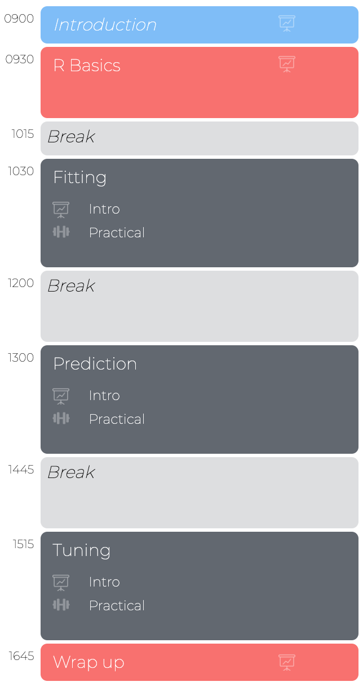

layout: true

<div class="my-footer">
  <span style="text-align:center">
    <span> 
      
    </span>
    <a href="https://therbootcamp.github.io/">
      <span style="padding-left:82px"> 
        <font color="#7E7E7E">
          www.therbootcamp.com
        </font>
      </span>
    </a>
    <a href="https://therbootcamp.github.io/">
      <font color="#7E7E7E">
      Applied Machine Learning with R @ AMLD  | January 2020
      </font>
    </a>
    </span>
  </div> 

---


```{r setup, include=FALSE}
options(htmltools.dir.version = FALSE)
options(width=110)
options(digits = 4)

knitr::opts_chunk$set(fig.align = 'center')
```


.pull-left45[
<br><br><br><br><br>

# Slides and Materials

Find our Materials under:

<font style="font-size:24px" color="#F62D73"><a href="https://therbootcamp.github.io/AML_2020AMLD/"><b>WETEACHR.COM/AML_2020AMLD</b></a></font><br><br>


]

.pull-right5[

<br><br>
<iframe src="https://therbootcamp.github.io/AML_2020AMLD" width="500" height="500"></iframe>

]

---


.pull-left45[

<br>

# We teach R

> We are Swiss-based data scientists who have jointly spent over 25 years doing data science with R for both research and industry. Our goal is to help you learn the skills needed to discover and communicate insights from data and join the data revolution.

<table class="tg"  style="cellspacing:0; cellpadding:0; border:none">
  <tr>
    <td style="vertical-align:top">
    <p align="center">
    <a href="www.dirkwulff.org"></a>
    <p align="center">
    <font size = 5><b>Dirk</b></font>&nbsp;&nbsp;
    <a href="www.dirkwulff.org"><i class='fas fa-home' style='font-size: 1em;'></i></a>
    <a href="https://github.com/dwulff"><i class='fab fa-github' style='font-size: 1em;'></i></a>
    </p>  
  </th>
  <td style="vertical-align:top">
    <p align="center">
    <a href="https://psychologie.unibas.ch/en/persons/markus-steiner/about-me/"></a>
    <p align="center">
    <font size = 5><b>Markus</b></font>&nbsp;&nbsp; 
    <a href="https://github.com/mdsteiner"><i class='fab fa-github' style='font-size: 1em;'></i></a>
    </p>
  </th>

</tr>

</table>

]

.pull-right45[

<br><br><br>

<p align="center"></p>


]

---

.pull-left6[

<br><br><br><br>


# Aim

<br>

> <font style='font-size:40px;font-family:"Yanone Kaffeesatz";font-weight:500'>The aim of this workshop is enable you to thoughtfully implement machine learning methods, using R, to make data-driven decisions.</font>

]

.pull-right4[

<br><br><br><br>
<p align="center"></p>

]


---

<p align = "center">
<br>
<font style="font-size:10px">from <a href="cnn.com">cnn.com</a></font>
</p>

---

# Data-driven decisions

.pull-left5[

<ul>
  <li class="m1"><span><b>Predicting Heart Attacks</b>
  <br><br>
  <ul class="level">
    <li><span>You are an intake nurse at an emergency room.</span></li>
    <li><span>A patient comes in complaining of chest pain and thinks he is having a heart attack.</span></li>
    <li><span><high><i>How do you decide whether or not the patient is really having a heart attack?</i></high></span></li>
  </ul>
  </span></li>
  <li class="m2"><span><b>Predicting Sales</b>
  <br><br>
  <ul class="level">
    <li><span>You are an analyst at a retail corporation.</span></li>
    <li><span>The executive team is considering whether or not to open a new retail location in Basel.</span></li>
    <li><span><high><i>How can you predict what the sales of the new store would be?</i></high></span></li>
  </ul>
  </span></li>
</ul>


]

.pull-right4[


<p align = "center">
<br>
<font style="font-size:10px">from <a href="https://medium.com/@dkwok94/machine-learning-for-my-grandma-ca242e97ef62">medium.com</a></font>
</p>

<p align = "center">
<br>
<font style="font-size:10px">from <a href="https://thirdmanrecords.com/locations/detroit-storefront">thirdmanrecords.com</a></font>
</p>

]


---

# Machine learning is data-driven

.pull-left45[

<b>Data-driven, ML-based heart rate prediction</b>

Based on <high>data</high> from past patients <high>at this hospital</high>, a <high>regression model</high>, using the patient's <high>age, cholesterol level, and ecg</high>, <high>predicts</high> the probability that this patient is having a heart attack is only <high>45%</high>.

<p align = "center">

</p>


] 

.pull-right45[

<p align = "center">
<br>
<font style="font-size:10px">from <a href="https://medium.com/@dkwok94/machine-learning-for-my-grandma-ca242e97ef62">medium.com</a></font>
</p>

<p align = "center">
<br>
<font style="font-size:10px">from <a href="https://thirdmanrecords.com/locations/detroit-storefront">thirdmanrecords.com</a></font>
</p>

] 


---

.pull-left25[

# Types of machine learning tasks


]

.pull-right7[

<br><br>

<p align = "center">
<br>
<font style="font-size:10px">from <a href="image/mltypes.png">amazonaws.com</a></font>
</p>
]

---

# Data terminology


.pull-left5[
<p>
<table style="cellspacing:0; cellpadding:0; border:none; padding-top:10px">

<tr>
  <td bgcolor="white">
    <b>Term</b>
  </td>
  <td bgcolor="white">
    <b>Definition</b>
  </td>  
  <td bgcolor="white">
    <b>Example</b>
  </td>  
</tr>
<tr>
  <td bgcolor="white">
    <i>Case</i>
  </td>
  <td bgcolor="white">
   A specific <high>observation</high> of data.
  </td>  
  <td bgcolor="white">
   A patient, a site, etc.
  </td>  
</tr>
<tr>
  <td bgcolor="white">
    <i>Feature</i>
  </td>
  <td bgcolor="white">
   An measurable <high>property</high> of cases. Also called predictors. 
  </td>  
  <td bgcolor="white">
   Age, temperature, country, etc.
  </td>  
</tr>
<tr>
  <td bgcolor="white">
    <i>Criterion</i>
  </td>
  <td bgcolor="white">
   The <high>feature</high> that you want to <high>predict</high>.
  </td>  
  <td bgcolor="white">
   Heart attack, sales, etc.
  </td>  
</tr>
<tr>
  <td bgcolor="white">
    <i>Data</i>
  </td>
  <td bgcolor="white">
   Typically <high>rectangular</high> representation of cases (rows) and features (columns).
  </td>  
  <td bgcolor="white">
   <mono>.csv</mono>, <mono>.xls</mono>, <mono>.sav</mono>, etc.
  </td>  
</tr>
</table>
</p>
]


.pull-right4[

<p align = "center">
<br>
</p>

]


---

# Supervised learning

.pull-left5[

<ul>
  <li class="m1"><span>The <high>dominant type</high> of machine learning.</span></li>
  <li class="m2"><span>Supervised learning uses <high>labeled data</high> to learn <high>a model</high> that relates the criterion to the features.</span></li>
</ul>

<u>Verbal model</u>

<font style="font-size:24px"><mono>if cp (chest pain) is not a (asymptomatic) and age is larger than 60 then high probability of hearth attack, otherwise low probability.</mono></font>


]

.pull-right4[

<p align = "center">
<br>
</p>
]

---

# 2 types of supervised problems

.pull-left5[

<ul>
  <li class="m1"><span><high>Regression</high>
  <br><br>
  <ul class="level">
    <li><span>Regression problems involve the <high>prediction of a quantitative feature</high>.</span></li>
    <li><span>E.g., predicting the cholesterol level as a function of age. </span></li>
  </ul>
  </span></li>
  <li class="m2"><span><high>Classification</high>
  <br><br>
  <ul class="level">
    <li><span>Classification problems involve the <high>prediction of a categorical feature</high>.   </span></li>
    <li><span>E.g., predicting the origin of chest pain as a function of age and heart attack risk. </span></li>
  </ul>
  </span></li>
</ul>


]

.pull-right4[

<p align = "center">
<br>
</p>

]

---

# Unsupervised learning

.pull-left5[

<ul>
  <li class="m1"><span>Analyzes the relationships among cases (<high>clustering</high>) or among features (<high>dimensionality reduction</high>) to <high>discover structures</high> such as groups or meta-features.</span></li>
</ul>


<table style="cellspacing:0; cellpadding:0; border:none; padding-top:10px">

<tr>
  <td bgcolor="white">
    <b>Approach</b>
  </td>
  <td bgcolor="white">
    <b>Description</b>
  </td>  
  <td bgcolor="white">
    <b>Example</b>
  </td>  
</tr>
<tr>
  <td bgcolor="white">
    <i>Clustering</i>
  </td>
  <td bgcolor="white">
   Analyze distances between cases to identify <high>clusters of homogeneous cases</high>.
  </td>  
  <td bgcolor="white">
   Types of customers or patients.
  </td>  
</tr>
<tr>
  <td bgcolor="white">
    <i>Dimension-<br>ality reduction</i>
  </td>
  <td bgcolor="white">
   Analyze correlations between features to identify <high>higher order features</high>. 
  </td>  
  <td bgcolor="white">
   Dimensions of personality or user experience.
  </td>  
</tr>
</table>


]

.pull-right4[


<p align = "center" height=380px>
<br>
</p>

]


---

# Reinforcement learning

.pull-left5[

<ul>
  <li class="m1"><span><high>Learns iteratively</high> from minimal supervision provided by <high>performance feedback</high>.</span></li>
  <li class="m2"><span>RL is closely <high>related to psychological theories of learning</high>.</span></li>
</ul>

<br>

<table style="cellspacing:0; cellpadding:0; border:none;">
  <col width="30%">
  <col width="70%">
<tr>
  <td bgcolor="white">
    <b>Application</b>
  </td>
  <td bgcolor="white">
    <b>Description</b>
  </td>  
</tr>
<tr>
  <td bgcolor="white">
    <i>Model fitting</i>
  </td>
  <td bgcolor="white">
   Iteratively <high>change model parameters</high> to improve prediction.  
</tr>
<tr>
  <td bgcolor="white">
    <i>Robot movements</i>
  </td>
  <td bgcolor="white">
   Iteratively <high>change movement</high> patterns to increase pancake-catch probability.  
</tr>
<tr>
  <td bgcolor="white">
    <i>Games</i>
  </td>
  <td bgcolor="white">
   Iteratively <high>change controller input</high> patterns to improve Mario Kart racing time.  
</tr>
</table>

]

.pull-right4[

<p align = "center">
<br>
<font style="font-size:10px">from <a href="https://giphy.com/explore/reinforcement-learning">giphy.com</a></font>
</p>

<p align = "center">
<br>
<font style="font-size:10px">from <a href="https://blogs.nvidia.com/blog/2017/04/14/tensorkart-ai-mario-kart/">nvidia.com</a></font>
</p>

]

---

# What we will cover


.pull-left45[


<ul>
  <li class="m1"><span><high>Core steps</high>
  <br><br>
  <ul class="level">
    <li><span>Fitting</span></li>
    <li><span>Prediction</span></li>
    <li><span>Tuning</span></li>
  </ul>
  </span></li>
  <li class="m2"><span><high>Supervised learning</high>
  <br><br>
  <ul class="level">
    <li><span>Regression</span></li>
    <li><span>Classification</span></li>
  </ul>
  </span></li>
  <li class="m3"><span><high>Algorithms</high>
  <br><br>
  <ul class="level">
    <li><span>Regression</span></li>
    <li><span>Decision trees</span></li>
    <li><span>Random forests</span></li>
  </ul>
  </span></li>
</ul>


]


.pull-right45[


<p align = "center">
<br>
<font style="font-size:10px">from <a href="https://medium.com/@danielgross/managing-machine-learning-43fe870b62be">medium.com</a></font>
</p>

]

---

# Machine learning is more than algorithms

<p align = "center">
<br>
<font style="font-size:10px">from <a href="https://www.houseofbots.com/images/news/11493/cover.png">houseofbots.com</a></font>
</p>

---

# `caret`

.pull-left55[

<ul>
  <li class="m1"><span>The <high>C</high>lassification <high>A</high>nd <high>RE</high>gression <high>T</high>raining package is a meta-package to streamline the application of R's best machine learning tools.  </span></li>
  <li class="m2"><span><mono>caret</mono> facilitates...
  <br><br>
  <ul class="level">
    <li><span><high>data pre-processing</high></span></li>
    <li><span><high>fitting, tuning, & model prediction</high></span></li>
  </ul>
  </span></li>
  <li class="m3"><span>Provides access to dozens of algorithms
  <br><br>
  <ul class="level">
    <li><span><high>regression, decision trees, random forests</high></span></li>
    <li><span>neural nets, AdaBoost, support vector machines, etc.</span></li>
  </ul>
  </span></li>
</ul>


]

.pull-right4[
<p align="center"></p>
<p align="center"></p>
<p align="center"></p>
]

---

.pull-left4[

# Schedule 

<ul>
  <li class="m1"><span><high>Schedule</high>
  <br><br>
  <ul class="level">
    <li><span>Intro to R</span></li>
    <li><span>3 blocks on ML with R</span></li>
  </ul>
  </span></li>
  <li class="m2"><span><high>Block</high>
  <br><br>
  <ul class="level">
    <li><span>Slide-based introduction</span></li>
    <li><span>Many exercises</span></li>
  </ul>
  </span></li>
</ul>


]

.pull-right45[
<br><br>


]


---

.pull-left45[

# Introduction


<ul>
  <li class="m1"><span><high>Introduction</high>
  <br><br>
  <ul class="level">
    <li><span>30-45 min</span></li>
    <li><span>Concepts & Code examples</span></li>
  </ul>
  </span></li>
  <li class="m2"><span><high>Materials</high>
  <br><br>
  <ul class="level">
    <li><span>Permanently <a href="https://therbootcamp.github.io/EDA_2019CSS/">available online</a></span></li>
    <li><span>PDFs will be available later</span></li>
  </ul>
  </span></li>
</ul>

]

.pull-right55[

<br>

<p align="center">

<br>
<font style="font-size:10px">from <a href="www.Freepik.com">Freepik.com</a></font>
</p>

<p align="center">

<br>
<font style="font-size:10px">from <a href="www.Freepik.com">Freepik.com</a></font>
</p>

]


---

.pull-left45[

# Practicals


<ul>
  <li class="m1"><span><high>Write your own scripts</high>
  <br><br>
  <ul class="level">
    <li><span>20 - 50 Aufgaben</span></li>
    <li><span>Increasingly getting difficult.</span></li>
    <li><span>Follow your own tempo.</span></li>
    <li><span>Answers are added later.</span></li>
  </ul>
  </span></li>
</ul>

]

.pull-right5[
<br>

  <iframe src="https://therbootcamp.github.io/AML_2020AMLD/_sessions/Fitting/Fitting_practical.html" height="480px" width = "500px"></iframe>

  Example: <a href="https://therbootcamp.github.io/AML_2020AMLD/_sessions/Fitting/Fitting_practical.html">Fitting Practical </a>

]


---

class: middle, center

<h1><a href=https://therbootcamp.github.io/AML_2020AMLD/index.html>Schedule</a></h1>


