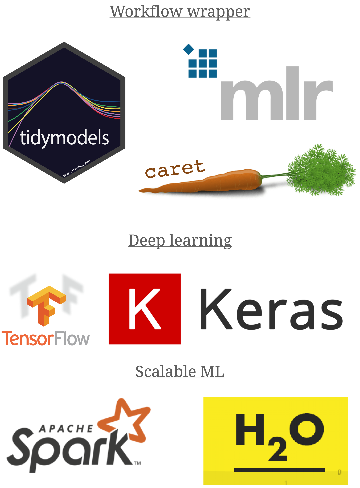
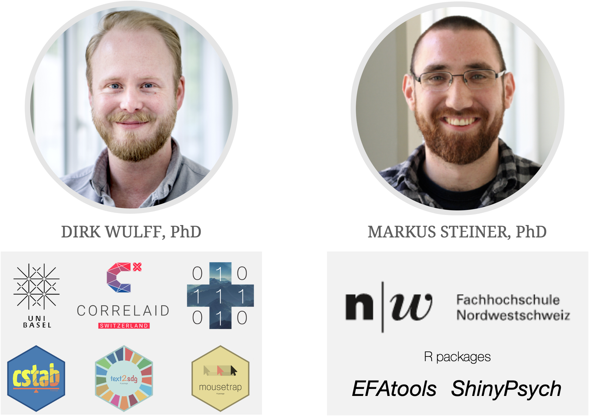

layout: true

<div class="my-footer">
  <span style="text-align:center">
    <span> 
      
    </span>
    <a href="https://therbootcamp.github.io/">
      <span style="padding-left:82px"> 
        <font color="#7E7E7E">
          www.therbootcamp.com
        </font>
      </span>
    </a>
    <a href="https://therbootcamp.github.io/">
      <font color="#7E7E7E">
      Applied Machine Learning with R @ AMLD  | November 2021
      </font>
    </a>
    </span>
  </div> 

---


```{r setup, include=FALSE}
options(htmltools.dir.version = FALSE)
options(width=110)
options(digits = 4)

knitr::opts_chunk$set(fig.align = 'center')
```


.pull-left45[
<br><br><br><br><br>

# Slides and Materials

Find our Materials under:

<font style="font-size:24px" color="#F62D73"><a href="https://therbootcamp.github.io/AML_2021AMLD/"><b>therbootcamp.com/AML_2021AMLD</b></a></font><br><br>


]

.pull-right5[

<br><br>
<iframe src="https://therbootcamp.github.io/AML_2021AMLD" width="500" height="500"></iframe>

]

---

.pull-left6[

<br><br><br><br>


# Aim

<br>

> <font style='font-size:40px;font-family:"Yanone Kaffeesatz";font-weight:500'>The aim of this workshop is enable you to thoughtfully implement supervised machine learning methods, using R and tidymodels, to make data-driven decisions.</font>

]

.pull-right4[

<br><br><br><br>
<p align="center"></p>

]


---

# What is machine learning?

.pull-left45[

<b>Machine learning is</b>...

<p style="padding-left:20px">

...a <high>field of artificial intelligence</high>...<br><br> 

...that uses <high>statistical techniques</high>... <br><br>

...to allow computer systems to <high>"learn"</high>,...<br><br>

...i.e., to progressively <high>improve performance</high> on a specific task...<br><br>

...from small or large amounts of <high>data</high>,... <br><br>

....<high>without being explicitly programmed</high>....<br><br>

....with the goal to <high>discover structure</high> or </high>improve decision making and predictions</high>.

</p>


]


.pull-right45[

<p align = "center">
<br>
<font style="font-size:10px">from <a href="https://medium.com/@dkwok94/machine-learning-for-my-grandma-ca242e97ef62">medium.com</a></font>
</p>


]


---

.pull-left3[

# Types of machine learning tasks


<ul>
  <li class="m1"><span>There are many types of machine learning tasks, each of which call for different models.</span></li>
  <li class="m2"><span><high>We will focus on supervised machine learning</high>.</span></li>
</ul>

]

.pull-right65[

<br><br>

<p align = "center">
<br>
<font style="font-size:10px">from <a href="image/mltypes.png">amazonaws.com</a></font>
</p>
]


---

# Supervised learning

.pull-left5[

<ul>
  <li class="m1"><span><high>The <high>dominant type</high> of machine learning.</span></li>
  <li class="m2"><span>Supervised learning uses <high>labeled data</high> to learn <high>a model</high> that relates the criterion to the features.</span></li>
</ul>


]

.pull-right4[

<p align = "center">
<br>
</p>
]


---

# 2 types of supervised problems

.pull-left5[

There are two types of supervised learning problems typically can be approached <high>using the same model</high>.

<font style="font-size:24px"><b>Regression</b></font>

Regression problems involve the <high>prediction of a quantitative feature</high>. 

E.g., predicting the cholesterol level as a function of age. 

<font style="font-size:24px"><b>Classification</b></font>

Classification problems involve the <high>prediction of a categorical feature</high>.   

E.g., predicting the origin of chest pain as a function of age and heart attack risk. 


]

.pull-right4[

<p align = "center">
<br>
</p>

]

---

# Three supervised models

```{r, echo = FALSE}
knitr::include_graphics("image/models.png")
```


---

.pull-left4[

# ML in R

<ul>
  <li class="m1"><span>R has advanced tremendously with respect to ML.</span></li>
  <li class="m2"><span>There exist <high>powerful and user-friendly</high> tools for all ML steps and algorithms.</span></li>
</ul>


]

.pull-right5[

<p align = "center">
<br><br>
<br>
</p>

]


---

.pull-left4[

# tidymodels

<ul>
  <li class="m1"><span><mono>tidymodels</mono> is a new meta-package for tidy ML in R.</span></li>
  <li class="m2"><span>Multiple packages span every important step of ML.</span></li>
</ul>

<br>
<p align = "center">
<br>
<font style="font-size:10px">from <a href="https://www.tidymodels.org/packages/">tidymodels.org</a></font>
</p>

]

.pull-right5[

<p align = "center">
<br>
<br>
</p>

]

---

.pull-left4[

# Schedule 

<ul>
  <li class="m1"><span><high>Schedule</high>
  <br><br>
  <ul class="level">
    <li><span>Intro to R</span></li>
    <li><span>3 blocks on ML with R</span></li>
  </ul>
  </span></li>
  <li class="m2"><span><high>Block</high>
  <br><br>
  <ul class="level">
    <li><span>Slide-based introduction</span></li>
    <li><span>Many exercises</span></li>
  </ul>
  </span></li>
</ul>


]

.pull-right45[
<br><br>


]


---

.pull-left45[

# Introduction


<ul>
  <li class="m1"><span><high>Introduction</high>
  <br><br>
  <ul class="level">
    <li><span>30-45 min</span></li>
    <li><span>Concepts & Code examples</span></li>
  </ul>
  </span></li>
  <li class="m2"><span><high>Materials</high>
  <br><br>
  <ul class="level">
    <li><span>Permanently <a href="https://therbootcamp.github.io/EDA_2019CSS/">available online</a></span></li>
    <li><span>PDFs will be available later</span></li>
  </ul>
  </span></li>
</ul>

]

.pull-right55[

<br>

<p align="center">

<br>
<font style="font-size:10px">from <a href="www.Freepik.com">Freepik.com</a></font>
</p>

<p align="center">

<br>
<font style="font-size:10px">from <a href="www.Freepik.com">Freepik.com</a></font>
</p>

]


---

.pull-left45[

# Practicals


<ul>
  <li class="m1"><span><high>Write your own scripts</high>
  <br><br>
  <ul class="level">
    <li><span>20 - 50 tasks</span></li>
    <li><span>Increasingly getting difficult.</span></li>
    <li><span>Follow your own tempo.</span></li>
    <li><span>Answers are added later.</span></li>
  </ul>
  </span></li>
</ul>

]

.pull-right5[
<br>

  <iframe src="https://therbootcamp.github.io/AML_2020AMLD/_sessions/Fitting/Fitting_practical.html" height="480px" width = "500px"></iframe>

  Example: <a href="https://therbootcamp.github.io/AML_2020AMLD/_sessions/Fitting/Fitting_practical.html">Fitting Practical </a>

]

---

.pull-left3[
# Introduction
]

.pull-right7[
<p align="left">
<br><br><br>

</p>
]
---

class: middle, center

<h1><a href=https://therbootcamp.github.io/AML_2021AMLD/index.html>Schedule</a></h1>

