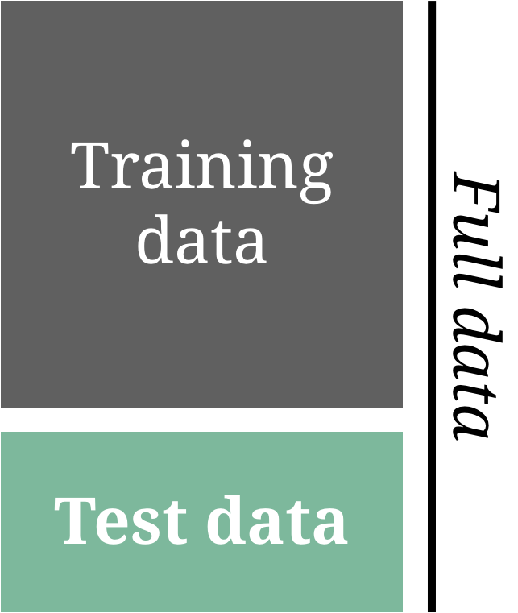
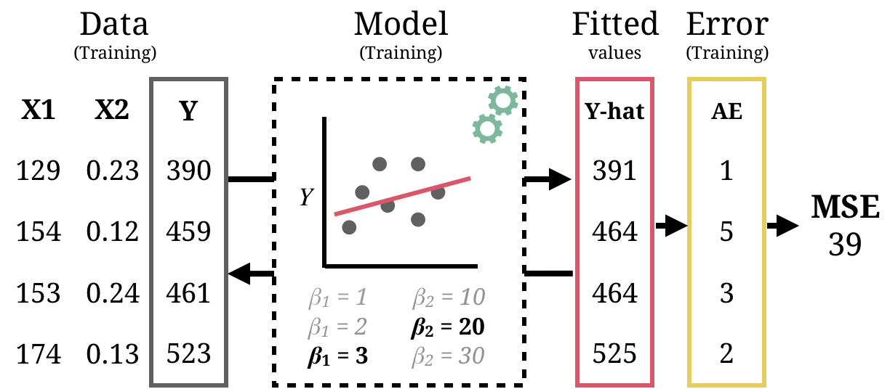
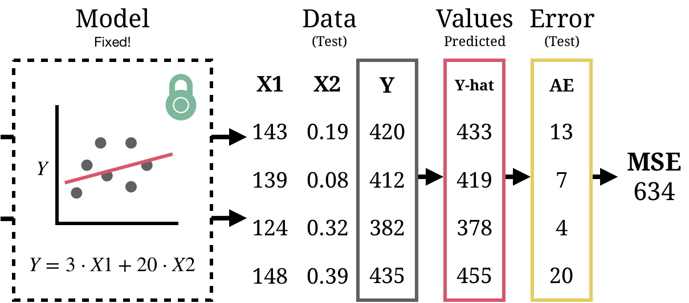
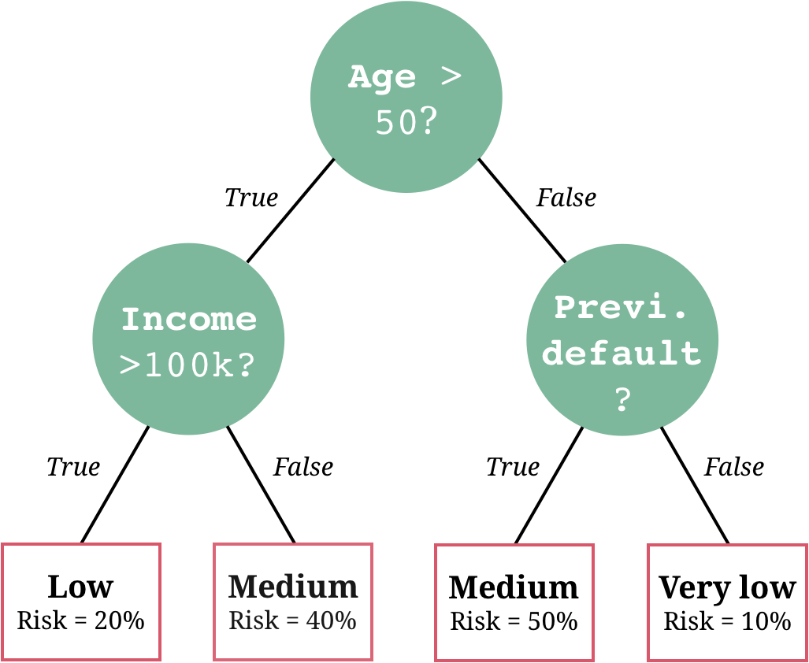
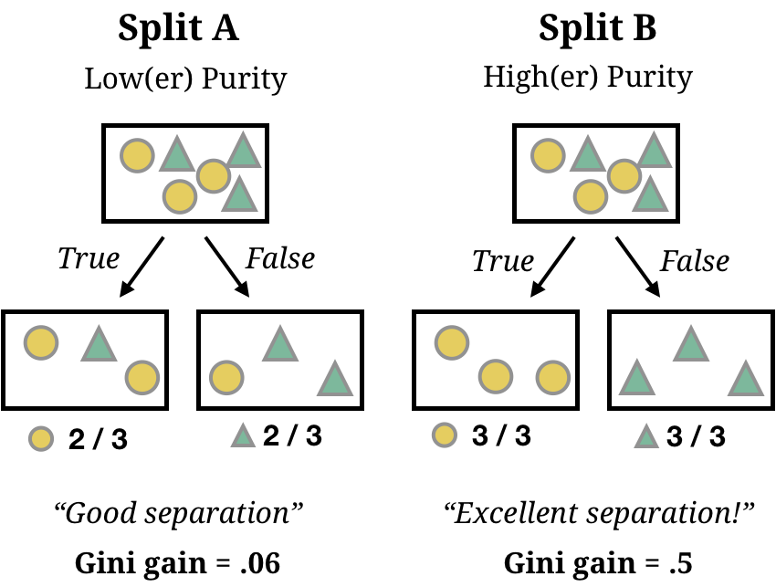
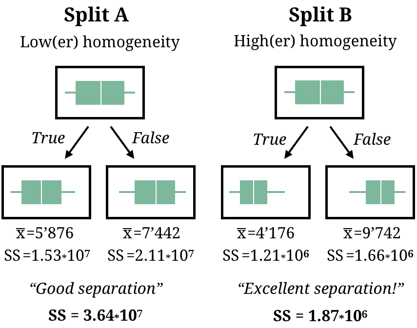
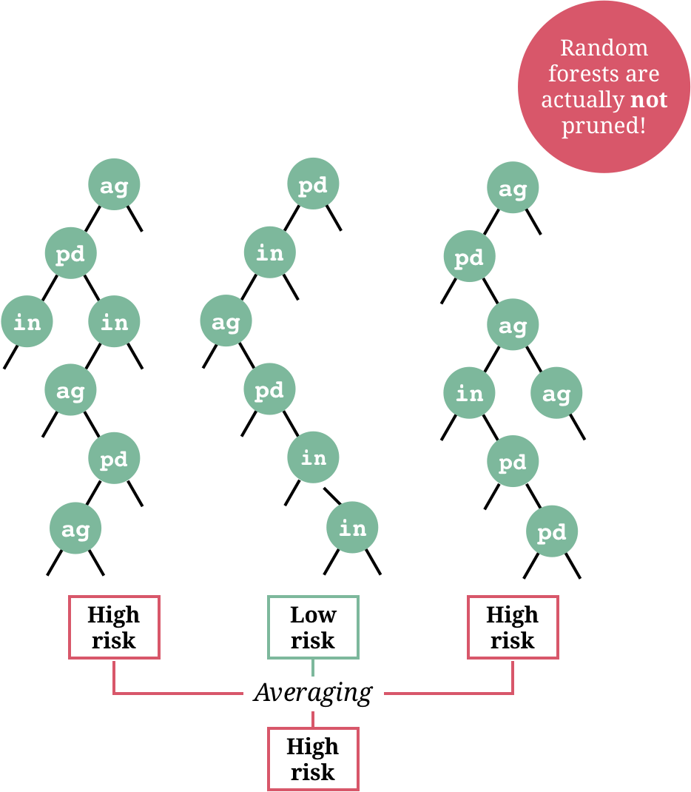

layout: true

<div class="my-footer">
  <span style="text-align:center">
    <span> 
      
    </span>
    <a href="https://therbootcamp.github.io/">
      <span style="padding-left:82px"> 
        <font color="#7E7E7E">
          www.therbootcamp.com
        </font>
      </span>
    </a>
    <a href="https://therbootcamp.github.io/">
      <font color="#7E7E7E">
      Applied Machine Learning with R @ AMLD  | November 2021
      </font>
    </a>
    </span>
  </div> 

---


```{r setup, include=FALSE}
library(tidyverse)
options(htmltools.dir.version = FALSE)
# see: https://github.com/yihui/xaringan
# install.packages("xaringan")
# see: 
# https://github.com/yihui/xaringan/wiki
# https://github.com/gnab/remark/wiki/Markdown
options(width=110)
options(digits = 4)

source("https://raw.githubusercontent.com/therbootcamp/ML_2019Oct/master/_materials/code/baselrbootcamp_palettes.R")


baselers <- read_csv("1_Data/baselers.csv") %>% 
  mutate(eyecor = factor(eyecor, levels = c("yes", "no")))
```

```{r, echo = FALSE ,message = FALSE, warning = FALSE}
knitr::opts_chunk$set(comment=NA, fig.width=6, fig.height=6, echo = TRUE, eval = TRUE, 
                      message = FALSE, warning = FALSE, fig.align = 'center', dpi = 200)
library(tidyverse)
library(tidymodels)
tidymodels_prefer()
library(ggthemes)
library(knitr)

set.seed(100)

past <- tibble(id = 1:5,
               sex = sample(c("m", "f"), size  = 5, replace = TRUE),
               age = round(rnorm(5, mean = 45, sd = 5), 0),
               fam_history = sample(c("Yes", "No"), size = 5, replace = TRUE),
               smoking = sample(c(TRUE, FALSE), size = 5, replace = TRUE),
               criterion = sample(c(0, 1), size = 5, replace = TRUE))

present <- tibble(id = 91:95,
                  sex = sample(c("m", "f"), size  = 5, replace = TRUE),
               age = round(rnorm(5, mean = 45, sd = 5), 0),
               fam_history = sample(c("Yes", "No"), size = 5, replace = TRUE),
               smoking = sample(c(TRUE, FALSE), size = 5, replace = TRUE),
               criterion = rep("?", 5))
```

# Predict hold-out data

.pull-left45[

<ul>
  <li class="m1"><span>Model performance must be evaluated as true prediction on an <high>unseen data set</high>.</span></li>
  <li class="m2"><span>The unseen data set can be <high>naturally</high> occurring, e.g., using 2019 stock prizes to evaluate a model fit using 2018 stock prizes.</span></li>
  <li class="m3"><span>More commonly unseen data is created by <high>splitting the available data</high> into a training set and a test set.</span></li>
</ul>

]


.pull-right45[

<p align = "center">

</p>

]

---

.pull-left4[

<br><br>
# Overfitting

<ul>
  <li class="m1"><span>Occurs when a model <high>fits data too closely</high> and therefore <high>fails to reliably predict</high> future observations.</span></li><br><br>
  <li class="m2"><span>In other words, overfitting occurs when a model <high>'mistakes' random noise for a predictable signal</high>.</span></li><br><br>
  <li class="m3"><span>More <high>complex models</high> are more <high>prone to overfitting</high>.</span></li>
</ul>


]


.pull-right5[
<br><br><br>
<p align = "center" style="padding-top:0px">

</p>

]


---

# Overfitting

```{r, fig.width = 8, fig.height = 3.5, echo = FALSE, eval = TRUE, warning = FALSE, dpi = 200}
set.seed(5)

N <- 40

iv <- rnorm(N, mean = 10, sd = 2)
truth <- iv 
noise <- rnorm(N, mean = 0, sd = 2)
obs <- truth + noise

data <- data.frame(iv, obs)


poly_pred <- map_dfc(.x = c(1, 19), .f = function(degree) {
  
  output <- data.frame(lm(obs ~ poly(iv, degree), data = data)$fitted.values)
  
  names(output) <- paste0("d", degree)
  
  return(output)

}) %>% mutate(id = 1:N,
              x = iv,
              obs = obs) %>%
  gather(Degree, pred, -id, -x, -obs) %>%
  mutate(`Training` = abs(pred - obs))


poly_pred <- poly_pred %>%
  mutate(Model = case_when(Degree == "d1" ~ "Simple model",
                            TRUE ~ "Complex model"))


overfit_gg <- ggplot(poly_pred, aes(x = x, y = pred, col = Model)) + 
  geom_line(size = 1.2) +
  geom_point(aes(x = x, y = obs), col = "black", pch = 21) +
  annotate("segment", x = 5, y = 5, xend = 15, yend = 15, col = "black", linetype = 4, size = 1) +
  xlim(5, 15) +
  ylim(5, 15) +
  labs(title = "Three models",
       subtitle = "Dashed line is TRUE model",
       x = "Feature",
       y = "Criterion") +
  theme_bw() +
    theme(legend.position="bottom") +
  scale_color_baselrbootcamp()
  
poly_pred <- poly_pred %>% mutate(

  obs_new = x + rnorm(1, mean = 0, sd = 2),
  `Testing` = abs(obs_new - pred)
  
)


poly_pred <- poly_pred %>%
  select(Model, `Training`, `Testing`) %>%
  gather(phase, Error, -Model)

agg <- poly_pred %>%
  group_by(Model, phase) %>%
  summarise(Error = mean(Error)) %>%
  ungroup() %>%
  mutate(phase = factor(phase, levels = c("Training", "Testing"), ordered = TRUE))
 
fit_gg <- ggplot(agg, aes(x = phase, y = Error, fill = Model)) +
  geom_bar(position = "dodge", stat = "identity") +
  labs(title = "Fitting versus prediction error",
       subtitle = "Smaller values are better!",
       x = "Modelling phase") +  
  scale_y_continuous(limits=c(.75,1.25),oob = scales::rescale_none) +
  theme_bw() +
    theme(legend.position="bottom") +
  scale_fill_baselrbootcamp()

ggpubr::ggarrange(overfit_gg, fit_gg)
```


---

# Training

<ul>
  <li class="m1"><span>Training a model means to <high>fit the model</high> to data by finding the parameter combination that <high>minizes some error function</high>, e.g., mean squared error (MSE).</span></li><br><br>
</ul>

<p align = "center">

</p>

---

# Test

<ul style="margin-bottom:-20px">
  <li class="m1"><span>To test a model means to <high>evaluate the prediction error</high> for a fitted model, i.e., for a <high>fixed parameter combination</high>.</span></li><br><br>
</ul>

<p align = "center">

</p>


---
class: center, middle

# Two new models enter the ring...

---
class: center, middle

<font color = "gray"><h1>Regression</h1></font>

<high><h1>Decision Trees</h1></high>

<font color = "gray"><h1>Random Forests</h1></font>

---

# CART

.pull-left45[

<ul>
  <li class="m1"><span>CART is short for <high>Classification and Regression Trees</high>, which are often just called <high>Decision trees</high>.</span></li><br>
  <li class="m2"><span>In <a href="https://en.wikipedia.org/wiki/Decision_tree">decision trees</a>, the criterion is modeled as a <high>sequence of logical TRUE or FALSE questions</high>.</span></li><br><br>
</ul>

]

.pull-right45[

<p align = "center" style="padding-top:0px">

</p>
]

---

# Classificiation trees

.pull-left45[

<ul>
  <li class="m1"><span>Classification trees (and regression trees) are created using a relatively simple <high>three-step algorithm</high>.</span></li><br>
  <li class="m2"><span>Algorithm:
  <br><br>
  <ul class="level">
    <li><span>1 - <high>Split</high> nodes to maximize <b>purity gain</b> (e.g., Gini gain).</span></li><br>
    <li><span>2 - <high>Repeat</high> until pre-defined threshold (e.g., <mono>minsplit</mono>) splits are no longer possible.</span></li><br>
    <li><span>3 - <high>Prune</high> tree to reasonable size.</span></li>
  </ul>
  </span></li>
</ul>

]

.pull-right45[

<p align = "center" style="padding-top:0px">

</p>
]

---

# Node splitting

.pull-left45[

<ul>
  <li class="m1"><span>Classification trees attempt to <high>minize node impurity</high> using, e.g., the <high>Gini coefficient</high>.</span></li>
</ul>


$$\large Gini(S) = 1 - \sum_j^kp_j^2$$

<ul>
  <li class="m2"><span>Nodes are <high>split</high> using the variable and split value that <high>maximizes Gini gain</high>.</span></li>
</ul>

$$Gini \; gain = Gini(S) - Gini(A,S)$$

<p style="padding:0;margin:0" align="center">with</p>

$$Gini(A, S) = \sum \frac{n_i}{n}Gini(S_i)$$

]


.pull-right45[


<p align = "center" style="padding-top:0px">

</p>

]

---

# Pruning trees

.pull-left45[

<ul>
  <li class="m1"><span>Classification trees are <high>pruned</high> back such that every split has a purity gain of at least <high><mono>cp</mono></high>, with <mono>cp</mono> often set to <mono>.01</mono>.</span></li>
  <li class="m2"><span>Minimize:</span></li>
</ul>

<br>

$$
\large
\begin{split}
Loss = & Impurity\,+\\
&cp*(n\:terminal\:nodes)\\
\end{split}
$$

]

.pull-right45[


<p align = "center" style="padding-top:0px">

</p>

]
---

# Regression trees

.pull-left45[

<ul>
  <li class="m1"><span>Trees can also be used to perform regression tasks. Instead of impurity, regression trees attempt to <high>minimize within-node variance</high>.</span></li><br>
</ul>

$$\large SSE = \sum_{i \in S_1}(y_i - \bar{y}_1)^2+\sum_{i \in S_2}(y_i - \bar{y}_2)^2$$

<ul>
  <li class="m2"><span>Algorithm:
  <br><br>
  <ul class="level">
    <li><span>1 - <high>Split</high> nodes to maximize <b>homogeneity gain</b>.</span></li><br>
    <li><span>2 - <high>Repeat</high> until pre-defined threshold (e.g., <mono>minsplit</mono>) splits are no longe possible.</span></li><br>
    <li><span>3 - <high>Prune</high> tree to reasonable size.</span></li>
  </ul>
  </span></li>
</ul>

]


.pull-right45[

<p align = "center" style="padding-top:0px">

</p>


]


---

# CART in <mono>tidymodels</mono>

.pull-left4[

<ul>
  <li class="m1"><span>Fit <high>decision trees</high> in <mono>tidymodels</mono> using <mono>decision_tree()</mono> in the model definition.</span></li>
  <li class="m2"><span>Set the engine to <mono>rpart</mono>.</span></li>
</ul>

]

.pull-right45[

```{r, eval = FALSE}

# specify a CART in regression mode
dt_model <- 
  decision_tree() %>% 
  set_engine("rpart") %>% 
  set_mode("regression")

# specify a CART in classification mode
dt_model <- 
  decision_tree() %>% 
  set_engine("rpart") %>% 
  set_mode("classification")

```


]


---
class: center, middle

<font color = "gray"><h1>Regression</h1></font>

<font color = "gray"><h1>Decision Trees</h1></font>

<high><h1>Random Forests</h1></high>

---

.pull-left45[

# Random Forest

<p style="padding-top:1px"></p>


<ul>
  <li class="m1"><span>In <a href="https://en.wikipedia.org/wiki/Random_forest">Random Forest</a>, the criterion is modeled as the <high>aggregate prediction of a large number of decision trees</high> each based on different features.</span></li><br>
  <li class="m2"><span>Algorithm:
  <br><br>
  <ul class="level">
    <li><span>1 - <high>Repeat</high> <i>n</i> times</span></li>
    &nbsp;&nbsp;&nbsp;&nbsp;&nbsp;&nbsp;&nbsp;1 - <high>Resample</high> data<br> 
    &nbsp;&nbsp;&nbsp;&nbsp;&nbsp;&nbsp;&nbsp;2 - <high>Grow</high> non-pruned decision tree<br>
    &nbsp;&nbsp;&nbsp;&nbsp;&nbsp;&nbsp;&nbsp;&nbsp;&nbsp;&nbsp;&nbsp;&nbsp;&nbsp;Each split <high>consider only <i>m</i><br>
    &nbsp;&nbsp;&nbsp;&nbsp;&nbsp;&nbsp;&nbsp;&nbsp;&nbsp;&nbsp;&nbsp;&nbsp;&nbsp;features</high>
    <li><span>2 - <high>Average</high> fitted values.</span></li><br>
  </ul>
  </span></li>
</ul>

]

.pull-right45[
<br>

<p align = "center" style="padding-top:0px">

</p>


]

---

# Random Forest

.pull-left45[

<p style="padding-top:1px"></p>


<ul>
  <li class="m1"><span>Random forests make use of important machine learning elements, <high>resampling</high> and <high>averaging</high> that together are also referred to as <high>bagging</high>.</span></li>
</ul>

<table style="cellspacing:0; cellpadding:0; border:none;">
  <col width="30%">
  <col width="70%">
<tr>
  <td bgcolor="white">
    <b>Element</b>
  </td>
  <td bgcolor="white">
    <b>Description</b>
  </td>  
</tr>
<tr>
  <td bgcolor="white">
    <i>Resampling</i>
  </td>
  <td bgcolor="white">
    Creates new data sets that vary in their composition thereby <high>deemphasizing idiosyncracies</high> of the available data. 
  </td>  
</tr>
<tr>
  <td bgcolor="white">
    <i>Averaging</i>
  </td>
  <td bgcolor="white">
    Combining predictions typically <high>evens out idiosyncracies</high> of the models created from single data sets.   
  </td>  
</tr>
</table>
]


.pull-right45[

<p align = "center" style="padding-top:0px">

</p>


]


---


# Random forests in <mono>tidymodels</mono>

.pull-left4[

<ul>
  <li class="m1"><span>Fit <high>random forests</high> in <mono>tidymodels</mono> using <mono>rand_forest()</mono> in the model definition.</span></li>
  <li class="m2"><span>Set the engine to, e.g., <mono>ranger</mono>.</span></li>
</ul>

]

.pull-right5[

```{r, eval = FALSE}
# specify a random forest in regression
# mode
rf_model <- 
  rand_forest() %>% 
  set_engine("ranger") %>% 
  set_mode("regression")

# specify a random forest in classification
# mode
rf_model <- 
  rand_forest() %>% 
  set_engine("ranger") %>% 
  set_mode("classification")

```


]


---


# Random forest engines in <mono>tidymodels</mono>

.pull-left4[

<ul>
  <li class="m1"><span>Show all available engines with <mono>show_engines("rand_forest")</mono>.</span></li>
</ul>

]

.pull-right45[


```{r eval=T, echo=T}
# show possible engines
show_engines("rand_forest")
```

]


---
class: center,  middle

<br><br>

# Evaluating model predictions with <mono>tidymodels</mono>

```{r, echo = FALSE, out.width = "30%"}
knitr::include_graphics("image/tidymodels.svg")
```


---

# Split data into training and test set

.pull-left4[

<ul>
  <li class="m1"><span>Use <mono>initial_split()</mono> to <high>split a dataset</high> into separate training and test datasets.</span></li>
</ul>

<br>

<table style="cellspacing:0; cellpadding:0; border:none;">
  <col width="30%">
  <col width="70%">
<tr>
  <td bgcolor="white">
    <b>Argument</b>
  </td>
  <td bgcolor="white">
    <b>Description</b>
  </td>  
</tr>
<tr>
  <td bgcolor="white">
    <mono>data</mono>
  </td>
  <td bgcolor="white">
    The dataset. Used to create a <high>balanced split</high>.  
  </td>  
</tr>
<tr>
  <td bgcolor="white">
    <mono>prop</mono>
  </td>
  <td bgcolor="white">
    The <high>proportion of data</high> going into the training set. Often <mono>.75</mono> (default) or <mono>.5</mono>.    
  </td>  
</tr>
<tr>
  <td bgcolor="white">
    <mono>strata</mono>
  </td>
  <td bgcolor="white">
    The criterion or another stratification variable. Used to create a <high>balanced split</high>.     
  </td>  
</tr>
</table>


]

.pull-right5[

```{r, eval = T, echo = TRUE}

# Get initial split
baselers_split <-
  initial_split(baselers,
                prop = .8,
                strata = income)

# Create training data
baselers_train <- training(baselers_split)

# Create test data
baselers_test <- testing(baselers_split)
```


]


---

# <mono>predict(, newdata)</mono>

.pull-left4[

<ul>
  <li class="m1"><span>To <high>test model predictions</high> with <mono>tidymodels</mono>, all you need to do is get a vector of predictions from a new dataframe <mono>newdata</mono> using the <mono>predict()</mono> function.</span></li>
</ul>

<br>

<table style="cellspacing:0; cellpadding:0; border:none;">
  <col width="30%">
  <col width="70%">
<tr>
  <td bgcolor="white">
    <b>Argument</b>
  </td>
  <td bgcolor="white">
    <b>Description</b>
  </td>  
</tr>
<tr>
  <td bgcolor="white">
    <mono>object</mono>
  </td>
  <td bgcolor="white">
    <mono>tidymodels</mono> fit object.  
  </td>  
</tr>
<tr>
  <td bgcolor="white">
    <mono>newdata</mono>
  </td>
  <td bgcolor="white">
    Test data sest. Must contain same features as provided in <mono>object</mono>.    
  </td>  
</tr>
</table>

]

.pull-right5[

```{r, eval = T}
# fit regression model

lm_recipe <- 
  recipe(income ~ ., data = baselers_train) %>% 
  step_dummy(all_nominal_predictors())

lm_model <- 
  linear_reg() %>% 
  set_engine("lm") %>% 
  set_mode("regression")

lm_workflow <- 
  workflow() %>% 
  add_recipe(lm_recipe) %>% 
  add_model(lm_model)

income_lm <- fit(lm_workflow,
                 data = baselers_train)

```

]


---

# <mono>predict(, newdata)</mono>

.pull-left4[

<ul>
  <li class="m1"><span>To <high>test model predictions</high> with <mono>tidymodels</mono>, all you need to do is get a vector of predictions from a new dataframe <mono>newdata</mono> using the <mono>predict()</mono> function.</span></li>
</ul>

<br>

<table style="cellspacing:0; cellpadding:0; border:none;">
  <col width="30%">
  <col width="70%">
<tr>
  <td bgcolor="white">
    <b>Argument</b>
  </td>
  <td bgcolor="white">
    <b>Description</b>
  </td>  
</tr>
<tr>
  <td bgcolor="white">
    <mono>object</mono>
  </td>
  <td bgcolor="white">
    <mono>tidymodels</mono> fit object.  
  </td>  
</tr>
<tr>
  <td bgcolor="white">
    <mono>newdata</mono>
  </td>
  <td bgcolor="white">
    Test data sest. Must contain same features as provided in <mono>object</mono>.    
  </td>  
</tr>
</table>

]

.pull-right5[

```{r, eval = T}

# generate out-of-sample predictions
lm_pred <-
  income_lm %>% 
  predict(baselers_test) %>% 
  bind_cols(baselers_test %>% select(income))

metrics(lm_pred, truth = income,
        estimate = .pred)
```

]


---
class: middle, center

<h1><a href=https://therbootcamp.github.io/AML_2021AMLD/_sessions/Prediction/Prediction_practical.html>Practical</a></h1>


