layout: true

<div class="my-footer">
  <span style="text-align:center">
    <span> 
      
    </span>
    <a href="https://therbootcamp.github.io/">
      <span style="padding-left:82px"> 
        <font color="#7E7E7E">
          www.therbootcamp.com
        </font>
      </span>
    </a>
    <a href="https://therbootcamp.github.io/">
      <font color="#7E7E7E">
      Applied Machine Learning with R @ AMLD  | November 2021
      </font>
    </a>
    </span>
  </div> 

---

```{r, eval = TRUE, echo = FALSE, warning=F,message=F}
# Code to knit slides
baselers <- readr::read_csv("1_Data/baselers.csv")


source("https://raw.githubusercontent.com/therbootcamp/ML_2019Oct/master/_materials/code/baselrbootcamp_palettes.R")
```


```{r setup, include=FALSE}
options(htmltools.dir.version = FALSE)
# see: https://github.com/yihui/xaringan
# install.packages("xaringan")
# see:
# https://github.com/yihui/xaringan/wiki
# https://github.com/gnab/remark/wiki/Markdown
options(width=110)
options(digits = 4)


```

```{r, echo = FALSE ,message = FALSE, warning = FALSE}
knitr::opts_chunk$set(comment=NA, fig.width=6, fig.height=6, echo = TRUE, eval = TRUE,
                      message = FALSE, warning = FALSE, fig.align = 'center', dpi = 200)
library(tidyverse)
#library(baselers)
library(ggthemes)
library(tidymodels)
tidymodels_prefer()

baselers <- read_csv("1_Data/baselers.csv") %>% 
  mutate(eyecor = factor(eyecor, levels = c("yes", "no")))

print2 <- function(x, nlines=10,...)
   cat(head(capture.output(print(x,...)), nlines), sep="\n")

set.seed(5)

N <- 40

iv <- rnorm(N, mean = 10, sd = 2)
truth <- iv
noise <- rnorm(N, mean = 0, sd = 2)
obs <- truth + noise

data <- data.frame(iv, obs)


poly_pred <- map_dfc(.x = c(1, 19), .f = function(degree) {

  output <- data.frame(lm(obs ~ poly(iv, degree), data = data)$fitted.values)

  names(output) <- paste0("d", degree)

  return(output)

}) %>% mutate(id = 1:N,
              x = iv,
              obs = obs) %>%
  gather(Degree, pred, -id, -x, -obs) %>%
  mutate(`Training` = abs(pred - obs))


poly_pred <- poly_pred %>%
  mutate(Degree = case_when(Degree == "d1" ~ "Simple",
                            TRUE ~ "Complex"))


overfit_gg <- ggplot(poly_pred, aes(x = x, y = pred, col = Degree)) +
  geom_line(size = 1.5) +
  geom_point(aes(x = x, y = obs), col = "black", pch = 21) +
  annotate("segment", x = 5, y = 5, xend = 15, yend = 15, col = "black", linetype = 4, size = 1) +
  xlim(5, 15) +
  ylim(5, 15) +
  labs(title = "Model overfitting",
       subtitle = "Dashed line is TRUE model") +
  theme_bw() +
    theme(legend.position="bottom") +
  scale_color_baselrbootcamp()

poly_pred <- poly_pred %>% mutate(

  obs_new = x + rnorm(1, mean = 0, sd = 2),
  `Testing` = abs(obs_new - pred)

)


poly_pred <- poly_pred %>%
  select(Degree, `Training`, `Testing`) %>%
  gather(phase, Error, -Degree)

agg <- poly_pred %>%
  group_by(Degree, phase) %>%
  summarise(Error = mean(Error)) %>%
  ungroup() %>%
  mutate(phase = factor(phase, levels = c("Training", "Testing"), ordered = TRUE))

fit_gg <- ggplot(agg, aes(x = phase, y = Error, fill = Degree)) +
  geom_bar(position = "dodge", stat = "identity") +
  labs(title = "Fitting versus Prediction Error",
       subtitle = "Smaller values are better!",
       x = "Modelling Phase") +  
  scale_y_continuous(limits=c(.75,1.25),oob = scales::rescale_none) +
  theme_bw() +
    theme(legend.position="bottom") +
  scale_fill_baselrbootcamp()

```


.pull-left4[
<br><br><br>
# Fighting overfitting

<ul>
  <li class="m1"><span>When a model <high>fits the training data too well</high> on the expense of its performance in prediction, this is called overfitting.</span></li>
  <li class="m2"><span>Just because model A is better than model B in training, does not mean it will be better in testing! Extremely flexible models are <high>'wolves in sheep's clothing'</high>.</span></li>
  <li class="m2"><span>But is there nothing we can do?.</span></li>
</ul>


]


.pull-right55[

<br><br>

<p align = "center">
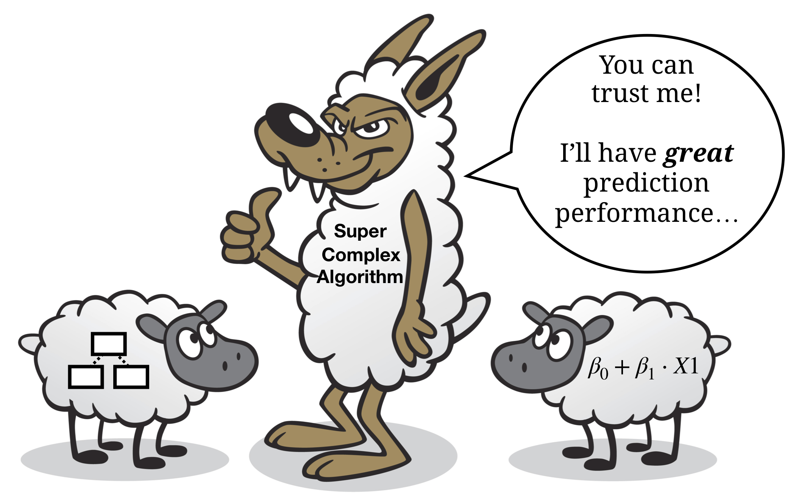<br>
<font style="font-size:10px">adapted from <a href="">victoriarollison.com</a></font>
</p>

]

---

# Tuning parameters

.pull-left45[

<ul>
  <li class="m1"><span>Machine learning models are equipped with tuning parameters that <high> control model complexity<high>.</span></li><br>
  <li class="m2"><span>These tuning parameters can be identified using a <high>validation set</high> created from the traning data.</span></li><br>
  <li class="m3"><span>Algorithm:
  <br><br>
  <ul class="level">
    <li><span>1 - Create separate test set.</span></li>
    <li><span>2 - Fit model using various tuning parameters.</span></li>
    <li><span>3 - Select tuning leading to best prediction on validation set.</span></li>
    <li><span>4 - Refit model to entire training set (training + validation).</span></li>
  </ul>
  </span></li>
</ul>


]

.pull-right45[

<p align = "center" style="padding-top:0px">
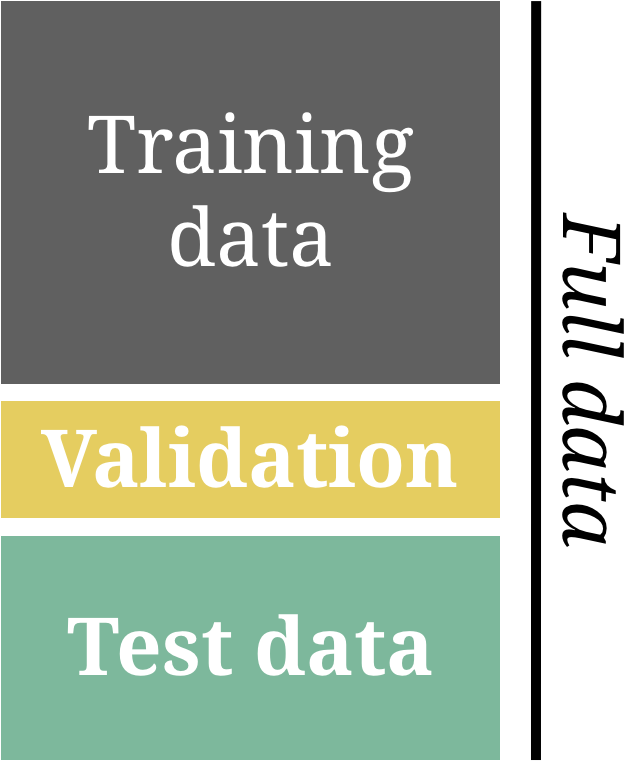
</p>

]

---

# Resampling methods

.pull-left4[

<ul>
  <li class="m1"><span>Resampling methods automatize and generalize model tuning.</span></li>
</ul>

<table style="cellspacing:0; cellpadding:0; border:none;">
  <col width="30%">
  <col width="70%">
<tr>
  <td bgcolor="white">
    <b>Method</b>
  </td>
  <td bgcolor="white">
    <b>Description</b>
  </td>  
</tr>
<tr>
  <td bgcolor="white">
    <i>k-fold cross-validation</i>
  </td>
  <td bgcolor="white">
    Splits the data in k-pieces, use <high>each piece once</high> as the validation set, while using the other one for training. 
  </td>  
</tr>
<tr>
  <td bgcolor="white">
    <i>Bootstrap</i>
  </td>
  <td bgcolor="white">
    For <i>B</i> bootstrap rounds <high>sample</high> from the data <high>with replacement</high> and split the data in training and validation set.  
  </td>  
</tr>
</table>
]

.pull-right5[

<p align = "center" style="padding-top:0px">
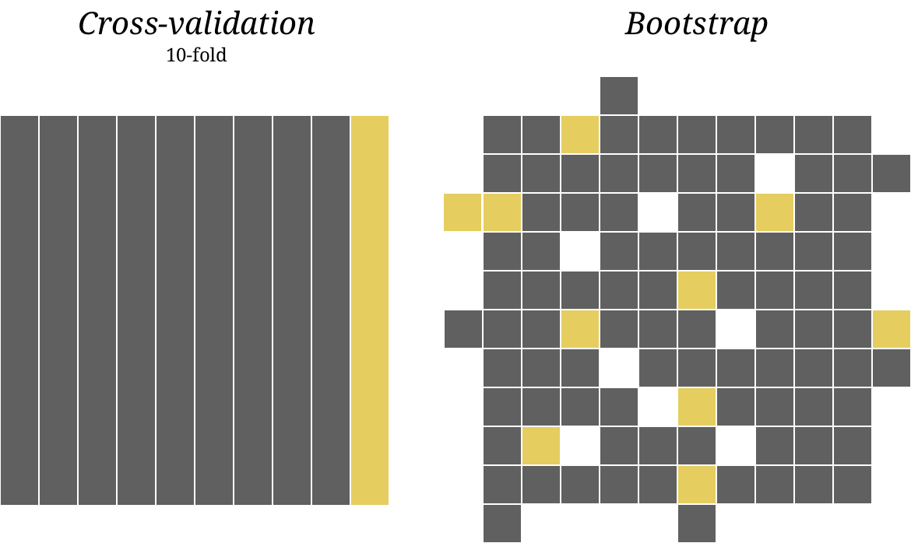
</p>

]

---

# Resampling methods

.pull-left4[

<ul>
  <li class="m1"><span>Resampling methods automatize and generalize model tuning.</span></li>
</ul>

<table style="cellspacing:0; cellpadding:0; border:none;">
  <col width="30%">
  <col width="70%">
<tr>
  <td bgcolor="white">
    <b>Method</b>
  </td>
  <td bgcolor="white">
    <b>Description</b>
  </td>  
</tr>
<tr>
  <td bgcolor="white">
    <i>k-fold cross-validation</i>
  </td>
  <td bgcolor="white">
    Splits the data in k-pieces, use <high>each piece once</high> as the validation set, while using the other one for training. 
  </td>  
</tr>
<tr>
  <td bgcolor="white">
    <i>Bootstrap</i>
  </td>
  <td bgcolor="white">
    For <i>B</i> bootstrap rounds <high>sample</high> from the data <high>with replacement</high> and split the data in training and validation set.  
  </td>  
</tr>
</table>
]

.pull-right5[

<p align = "center" style="padding-top:0px">
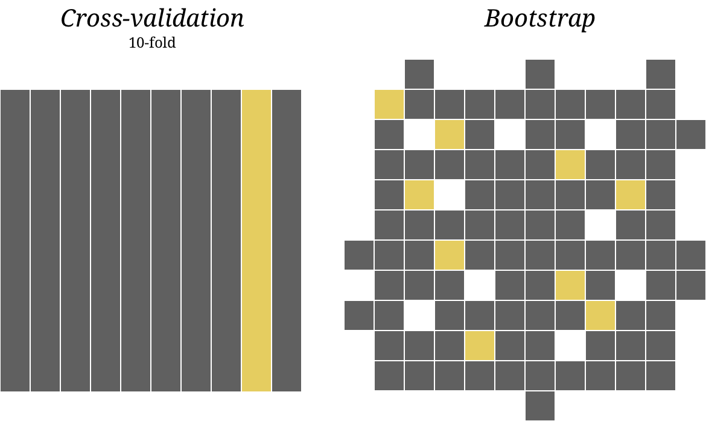
</p>

]

---

# Resampling methods

.pull-left4[

<ul>
  <li class="m1"><span>Resampling methods automatize and generalize model tuning.</span></li>
</ul>

<table style="cellspacing:0; cellpadding:0; border:none;">
  <col width="30%">
  <col width="70%">
<tr>
  <td bgcolor="white">
    <b>Method</b>
  </td>
  <td bgcolor="white">
    <b>Description</b>
  </td>  
</tr>
<tr>
  <td bgcolor="white">
    <i>k-fold cross-validation</i>
  </td>
  <td bgcolor="white">
    Splits the data in k-pieces, use <high>each piece once</high> as the validation set, while using the other one for training. 
  </td>  
</tr>
<tr>
  <td bgcolor="white">
    <i>Bootstrap</i>
  </td>
  <td bgcolor="white">
    For <i>B</i> bootstrap rounds <high>sample</high> from the data <high>with replacement</high> and split the data in training and validation set.  
  </td>  
</tr>
</table>
]

.pull-right5[

<p align = "center" style="padding-top:0px">
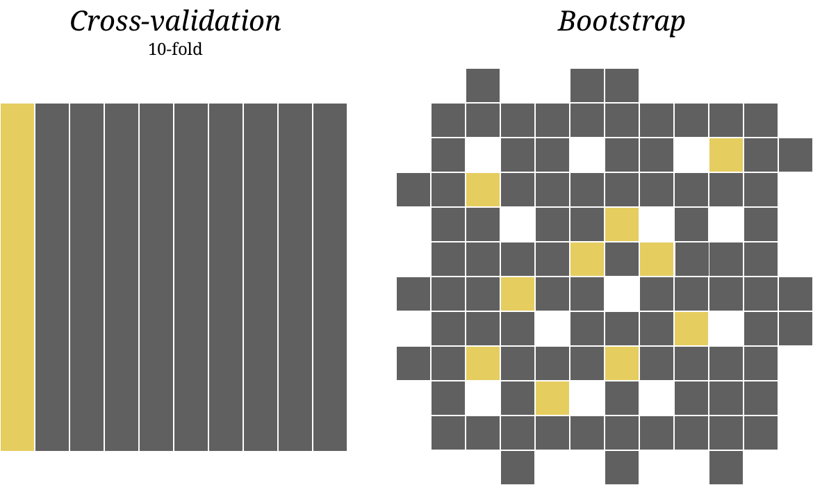
</p>

]

---

class: center, middle

<high><h1>Regression</h1></high>

<font color = "gray"><h1>Decision Trees</h1></font>

<font color = "gray"><h1>Random Forests</h1></font>


---

# Regularized regression

.pull-left45[

<ul>
  <li class="m1"><span>Penalizes regression loss for having large <font style="font-size:22px">&beta;</font> values using the <high>lambda &lambda; tuning parameter</high> and one of several penalty functions.</span></li>
</ul>


$$Regularized \;loss = \sum_i^n (y_i-\hat{y}_i)^2+\lambda \sum_j^p f(\beta_j)) $$
<table style="cellspacing:0; cellpadding:0; border:none;">
<tr>
  <td bgcolor="white">
    <b>Name</b>
  </td>
  <td bgcolor="white">
    <b>Function</b>
  </td> 
  <td bgcolor="white">
    <b>Description</b>
  </td> 
</tr>
<tr>
  <td bgcolor="white">
    <i>Lasso</i>
  </td>
  <td bgcolor="white">
    |&beta;<sub>j</sub>|
  </td> 
  <td bgcolor="white">
    Penalize by the <high>absolute</high> regression weights.
  </td> 
</tr>
<tr>
  <td bgcolor="white">
    <i>Ridge</i>    
  </td>
  <td bgcolor="white">
    &beta;<sub>j</sub><sup>2</sup>
  </td>  
  <td bgcolor="white">
    Penalize by the <high>squared</high> regression weights.
  </td> 
</tr>
<tr>
  <td bgcolor="white">
    <i>Elastic net</i>
  </td>
  <td bgcolor="white">
    |&beta;<sub>j</sub>| + &beta;<sub>j</sub><sup>2</sup>
  </td> 
  <td bgcolor="white">
    Penalize by Lasso and Ridge penalties.
  </td> 
</tr>
</table>


]


.pull-right45[

<p align = "center">
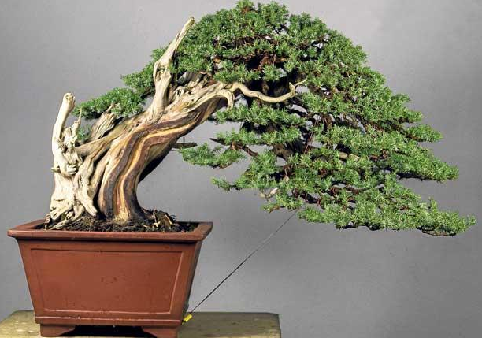<br>
<font style="font-size:10px">from <a href="https://www.mallorcazeitung.es/leben/2018/05/02/bonsai-liebhaber-mallorca-kunst-lebenden/59437.html">mallorcazeitung.es</a></font>
</p>

]

---


.pull-left45[

# Regularized regression

<p style="padding-top:1px"></p>

<ul>
  <li class="m1"><span><b>Ridge</b>
  <br><br>
  <ul class="level">
    <li><span>By penalizing the most extreme &beta;s most strongly, Ridge leads to (relatively) more <high>uniform &beta;s</high>.</span></li>
  </ul>
  </span></li><br><br><br><br>
  <li class="m2"><span><b>Lasso</b>
  <br><br>
  <ul class="level">
    <li><span>By penalizing all &beta;s equally, irrespective of magnitude, Lasso drives some &beta;s to 0 resulting effectively in <high>automatic feature selection</high>.</span></li>
  </ul>
  </span></li>
</ul>


]

.pull-right45[

<br>

<p align = "center">
<font style="font-size:40"><i>Ridge</i></font><br>
  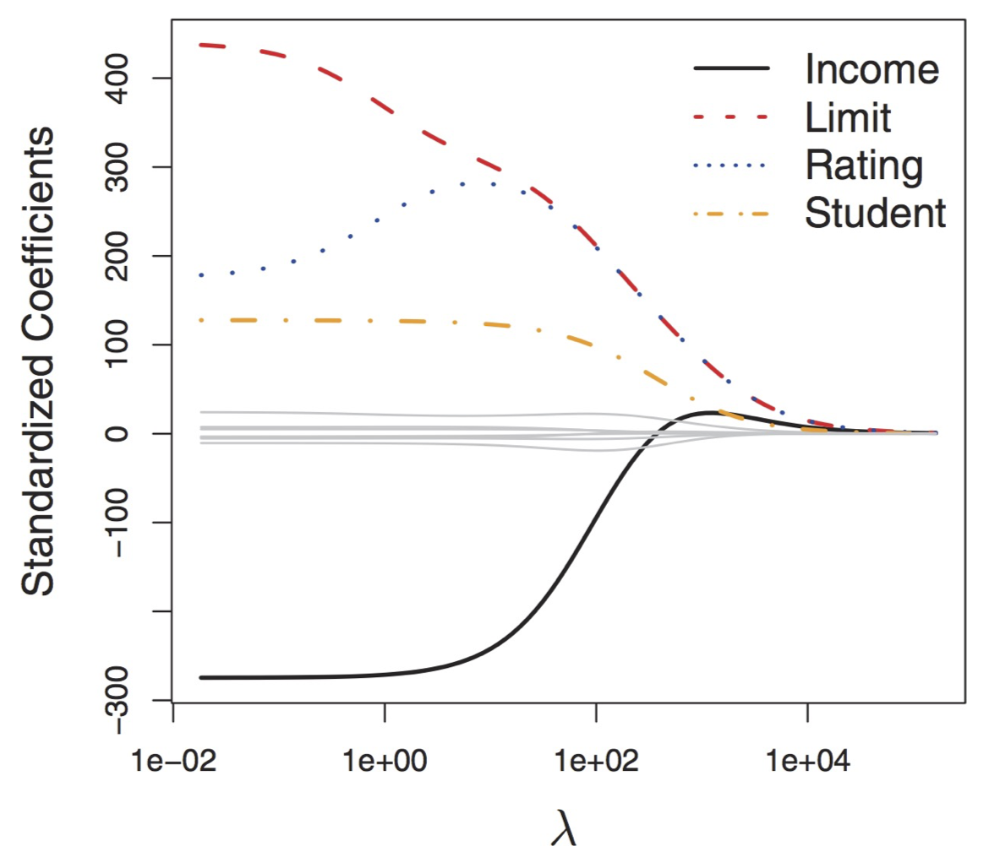<br>
  <font style="font-size:10px">from <a href="https://www-bcf.usc.edu/~gareth/ISL/ISLR%20First%20Printing.pdf">James et al. (2013) ISLR</a></font>
</p>

<p align = "center">
<font style="font-size:40"><i>Lasso</i></font><br>
    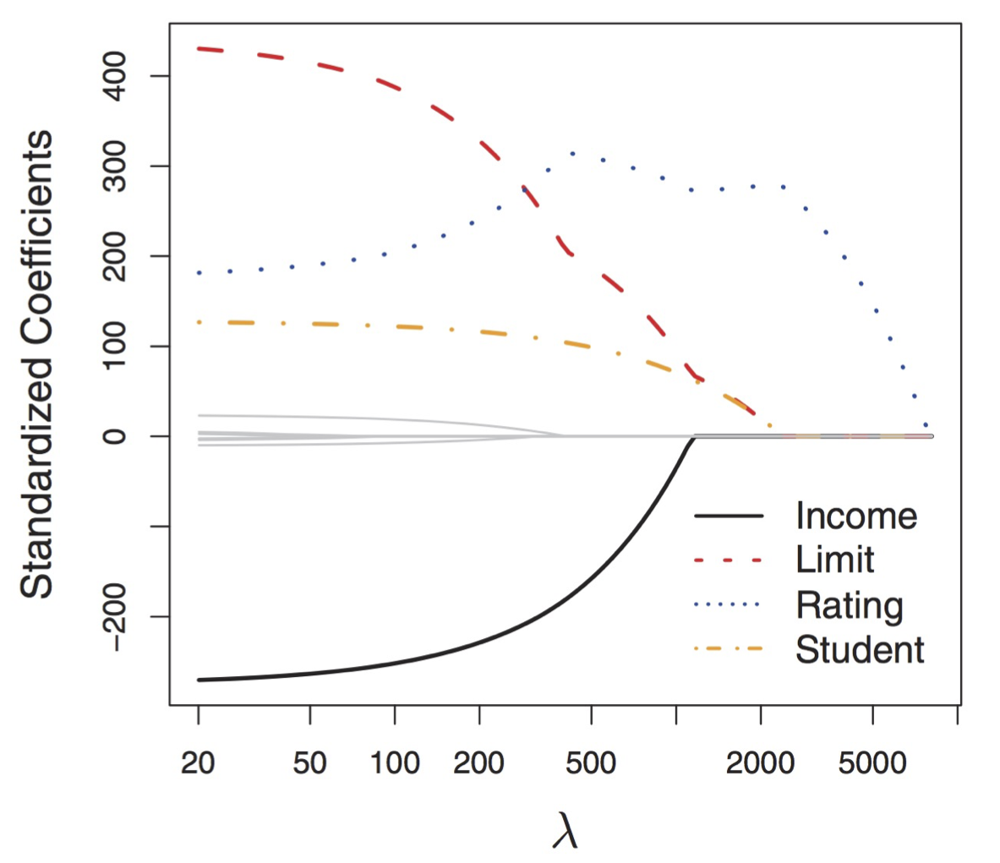<br>
    <font style="font-size:10px">from <a href="https://www-bcf.usc.edu/~gareth/ISL/ISLR%20First%20Printing.pdf">James et al. (2013) ISLR</a></font>
</p>

]


---

# Regularized regression


.pull-left4[


<ul>
  <li class="m1"><span>To fit Lasso or Ridge penalized regression in R, use the <mono>glmnet</mono> engine.</span></li>
  <li class="m2"><span>Specify the <high>type of penalty</high> and the <high>penalty weight</high>in the model definition.</span></li>
</ul>

<br>

<table style="cellspacing:0; cellpadding:0; border:none;">
<tr>
  <td bgcolor="white">
    <b>Parameter</b>
  </td>
  <td bgcolor="white">
    <b>Description</b>
  </td> 
</tr>
<tr>
  <td bgcolor="white">
    <mono>mixture = 1</mono>
  </td>
  <td bgcolor="white">
    Regression with Lasso penalty.
  </td> 
</tr>
<tr>
  <td bgcolor="white">
    <mono>mixture = 0</mono>
  </td>
  <td bgcolor="white">
    Regression with Ridge penalty.
  </td> 
</tr>
<tr>
  <td bgcolor="white">
    <mono>penalty</mono>
  </td>
  <td bgcolor="white">
  Regularization penalty weight.
  </td> 
</tr>
</table>


]

.pull-right45[

```{r, eval = FALSE}

# Ridge regression model
ridge_model <- 
  linear_reg(mixture = 0,
             penalty = 1) %>% 
  set_engine("glmnet") %>% 
  set_mode("regression")

# Lasso regression model
lasso_model <- 
  linear_reg(mixture = 1,
             penalty = 1) %>% 
  set_engine("glmnet") %>% 
  set_mode("regression")
```

]


---

class: center, middle

<font color = "gray"><h1>Regression</h1></font>

<high><h1>Decision Trees</h1></high>

<font color = "gray"><h1>Random Forests</h1></font>

---

# Decision trees

.pull-left4[

<ul>
  <li class="m1"><span>Decision trees have a <high>complexity parameter</high> called <high>cp</high>.</span></li>
</ul>


<p style="padding-top:3px"></p>

$$
\large
\begin{split}
Loss = & Impurity\,+\\
&cp*(n\:terminal\:nodes)\\
\end{split}
$$
<p style="padding-top:3px"></p>

<table style="cellspacing:0; cellpadding:0; border:none;">
<tr>
  <td bgcolor="white">
    <b>Parameter</b>
  </td>
  <td bgcolor="white">
    <b>Description</b>
  </td> 
</tr>
<tr>
  <td bgcolor="white">
    Small <mono>cp</mono>, e.g., <mono>cp<.01</mono>
  </td>
  <td bgcolor="white">
    Low penalty leading to <high>complex trees</high>.
  </td> 
</tr>
<tr>
  <td bgcolor="white">
    Large <mono>cp</mono>, e.g., <mono>cp<.20</mono>
  </td>
  <td bgcolor="white">
    Large penalty leading to <high>simple trees</high>.
  </td> 
</tr>
</table>

]


.pull-right5[

<p align = "center">
  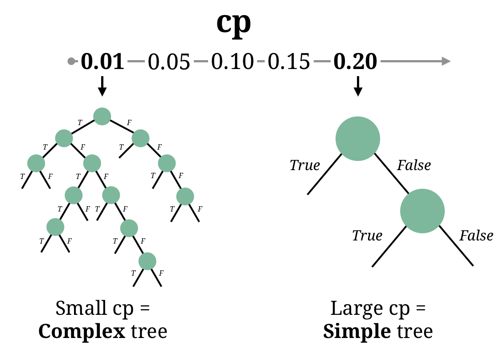
</p>


]


---

# Decision trees

.pull-left4[

<ul>
  <li class="m1"><span>Decision trees have a <high>complexity parameter</high> called <high>cost_complexity</high> (or, often, <high>cp</high>).</span></li>
</ul>


<p style="padding-top:3px"></p>

$$
\large
\begin{split}
Loss = & Impurity\,+\\
&cp*(n\:terminal\:nodes)\\
\end{split}
$$
<p style="padding-top:3px"></p>

<table style="cellspacing:0; cellpadding:0; border:none;">
<tr>
  <td bgcolor="white">
    <b>Parameter</b>
  </td>
  <td bgcolor="white">
    <b>Description</b>
  </td> 
</tr>
<tr>
  <td bgcolor="white">
    Small <mono>cost_complexity</mono>, e.g., <mono>cp<.01</mono>
  </td>
  <td bgcolor="white">
    Low penalty leading to <high>complex trees</high>.
  </td> 
</tr>
<tr>
  <td bgcolor="white">
    Large <mono>cost_complexity</mono>, e.g., <mono>cp<.20</mono>
  </td>
  <td bgcolor="white">
    Large penalty leading to <high>simple trees</high>.
  </td> 
</tr>
</table>

]

.pull-right5[

```{r, eval = FALSE}
# Decision tree with a defined cp = .01
dt_model <- 
  decision_tree(cost_complexity = .1) %>% 
  set_engine("rpart") %>% 
  set_mode("regression")

# Decision tree with a defined cp = .2
dt_model <- 
  decision_tree(cost_complexity = .2) %>% 
  set_engine("rpart") %>% 
  set_mode("regression")
```

]

---

class: center, middle

<font color = "gray"><h1>Regression</h1></font>

<font color = "gray"><h1>Decision Trees</h1></font>

<high><h1>Random Forests</h1></high>


---

# Random Forest

.pull-left4[

<ul>
  <li class="m1"><span>Random Forests have a <high>diversity parameter</high> called <mono>mtry</mono>.</span></li>
  <li class="m2"><span>Technically, this controls how many features are randomly considered at each split of the trees..</span></li>
</ul>

<table style="cellspacing:0; cellpadding:0; border:none;">
<tr>
  <td bgcolor="white">
    <b>Parameter</b>
  </td>
  <td bgcolor="white">
    <b>Description</b>
  </td> 
</tr>
<tr>
  <td bgcolor="white">
    Small <mono>mtry</mono>, e.g., <mono>mtry = 1</mono>
  </td>
  <td bgcolor="white">
    <high>Diverse forest.</high> In a way, less complex.
  </td> 
</tr>
<tr>
  <td bgcolor="white">
    Large <mono>mtry</mono>, e.g., <mono>mtry>5</mono>
  </td>
  <td bgcolor="white">
    <high>Similar forest.</high> In a way, more complex.
  </td> 
</tr>
</table>

]

.pull-right5[

<p align = "center">
  
</p>

]

---

# Random Forest

.pull-left4[

<ul>
  <li class="m1"><span>Random Forests have a <high>diversity parameter</high> called <mono>mtry</mono>.</span></li>
  <li class="m2"><span>Technically, this controls how many features are randomly considered at each split of the trees.</span></li>
</ul>

<table style="cellspacing:0; cellpadding:0; border:none;">
<tr>
  <td bgcolor="white">
    <b>Parameter</b>
  </td>
  <td bgcolor="white">
    <b>Description</b>
  </td> 
</tr>
<tr>
  <td bgcolor="white">
    Small <mono>mtry</mono>, e.g., <mono>mtry = 1</mono>
  </td>
  <td bgcolor="white">
    <high>Diverse forest.</high> In a way, less complex.
  </td> 
</tr>
<tr>
  <td bgcolor="white">
    Large <mono>mtry</mono>, e.g., <mono>mtry>5</mono>
  </td>
  <td bgcolor="white">
    <high>Similar forest.</high> In a way, more complex.
  </td> 
</tr>
</table>

]

.pull-right5[

```{r, eval = FALSE}
# Random forest with a defined mtry = 2
rf_model <-
  rand_forest(mtry = 2) %>% 
  set_engine("ranger") %>% 
  set_mode("regression")

# Random forest with a defined mtry = 5
rf_model <-
  rand_forest(mtry = 5) %>% 
  set_engine("ranger") %>% 
  set_mode("regression")
```

]


---

class: center,  middle

<p align = "center">
<br>
<font style="font-size:10px">from <a href="https://www.tidymodels.org/packages/">tidymodels.org</a></font>
</p>


---

.pull-left4[

# Fitting <mono>tidymodels</mono>

<br>
<ul>
  <li class="m1"><span>Specify resampling</span></li><br>
  <li class="m2"><span>Set up model tuning</span></li><br>
  <li class="m3"><span>Define grid</span></li><br>
  <li class="m4"><span>Tune model</span></li><br>
  <li class="m5"><span>Select best model</span></li><br>
  <li class="m5"><span>Retrain and evaluate</span></li><br>
</ul>

]

.pull-right5[

<p align = "center">
<br>
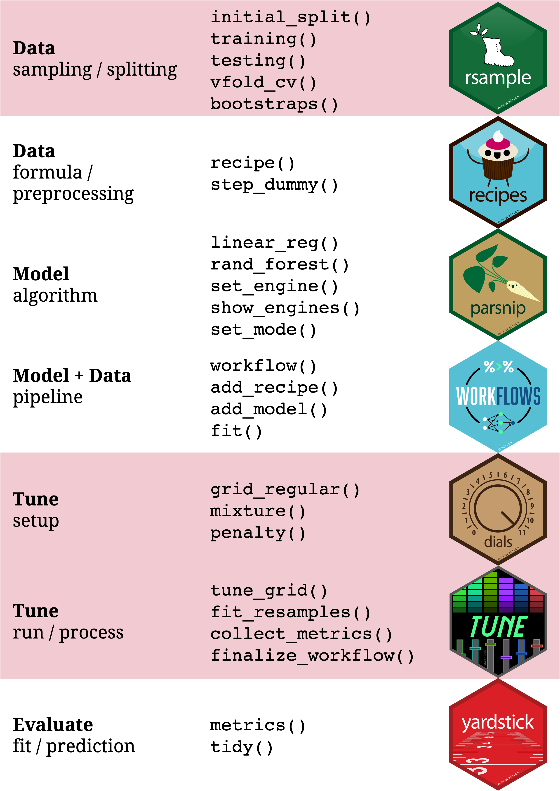<br>
</p>

]


---

.pull-left45[

# <i>v</i>-fold cross validation

<p style="padding-top:1px"></p>

<ul>
  <li class="m1"><span><b>Goal</b>
  <br><br>
  <ul class="level">
    <li><span>Use 10-fold cross-validation to identify <high>optimal regularization parameters</high> for a regression model.</span></li>
  </ul>
  </span></li><br>
  <li class="m2"><span><b>Using</b>
  <br><br>
  <ul class="level">
    <li><span><font style="font-size:22px"><mono>&alpha;	&isin; 0, .5., 1</mono></font> and <font style="font-size:22px"><mono>&lambda;	&isin; 1, 2., ..., 100</mono></font>.</span></li>
  </ul>
  </span></li>
</ul>

]


.pull-right45[

<br><br><br>

<p align = "center">
  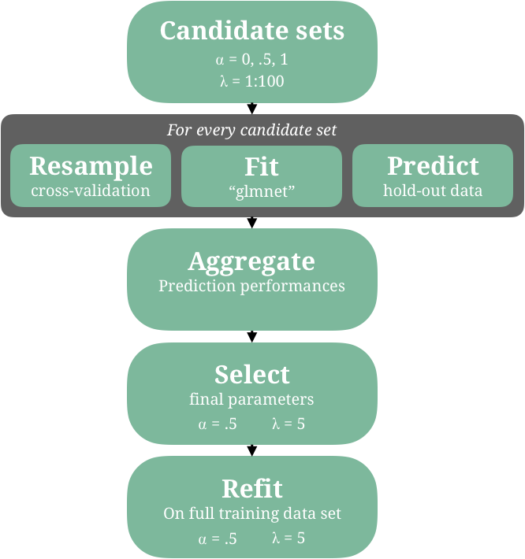
</p>


]


---

# Specify resampling

.pull-left4[

<ul>
  <li class="m1"><span>Specify the use of v-fold cross-validation using the <mono>vfold_cv()</mono> function.</span></li>
</ul>


<table style="cellspacing:0; cellpadding:0; border:none;">
<tr>
  <td bgcolor="white">
    <b>Argument</b>
  </td>
  <td bgcolor="white">
    <b>Description</b>
  </td>  
</tr>
<tr>
  <td bgcolor="white">
    <mono>data</mono>
  </td>
  <td bgcolor="white">
    The training data.
  </td>  
</tr>
<tr>
  <td bgcolor="white">
    <mono>v</mono>
  </td>
  <td bgcolor="white">
    The number of folds.
  </td>  
</tr>
<tr>
  <td bgcolor="white">
    <mono>repeats</mono>
  </td>
  <td bgcolor="white">
    The number of repeats
  </td>  
</tr>
<tr>
  <td bgcolor="white">
    <mono>strata</mono>
  </td>
  <td bgcolor="white">
    A stratification variable.
  </td>  
</tr>
</table>


]

.pull-right5[

```{r}
# split data
baselers_split <- initial_split(baselers)
baselers_train <- training(baselers_split)
baselers_test <- testing(baselers_split)

# specify 10 fold cross-validation
baselers_folds <- vfold_cv(baselers_train,
                           v = 10)
```

]

---

# Set up model tuning

.pull-left4[

<ul>
  <li class="m1"><span>Parameters that should be tuned have to be specified in the model definition.</span></li>
  <li class="m2"><span>To do so, set the respective parameter argument to <mono>tune()</mono>.</span></li>
</ul>

]

.pull-right5[

```{r}
# define recipe
recipe <- 
  recipe(income ~ .,
         data = baselers_train) %>%
  step_dummy(all_nominal_predictors()) %>% 
  step_normalize(all_numeric_predictors())

# glmnet where mixture and penalty is tuned
glmnet_model <- 
  linear_reg(mixture = tune(),
             penalty = tune()) %>% 
  set_engine("glmnet") %>% 
  set_mode("regression")

# define workflow
glmnet_workflow <- 
  workflow() %>% 
  add_recipe(recipe) %>% 
  add_model(glmnet_model)

```

]


---

# Define grid

.pull-left4[


<ul>
  <li class="m1"><span>Two ways to specify a grid of parameter values:</span></li>
<ul class="levels">
  <li><span>Use <mono>grid_regular</mono> and similar functions automatically choose reasonable values.</span></li>
  <li><span>Specify a <mono>tibble</mono> to define specific ranges and combinations.</span></li>
</ul>
</ul>
]

.pull-right5[

```{r}

# using tidymodels to generate values
parameter_grid <- grid_regular(mixture(),
                               penalty(),
                               levels = 50)

# determine values yourself
parameter_grid <-
  crossing(mixture = c(0, .5, 1),
           penalty = 1:100)
```

]


---

# Tune parameters with <mono>tune_grid()</mono>


.pull-left4[


<ul>
  <li class="m1"><span>Supply <mono>tune_grid()</mono> with:</span></li>
<ul class="levels">
  <li><span>The <mono>workflow</mono></span></li>
  <li><span>The resampling data</span></li>
  <li><span>The parameter grid</span></li>
</ul>
</ul>

]

.pull-right5[

```{r eval = FALSE}
# tune parameters using 10 fold CV
glmnet_grid <- 
  tune_grid(glmnet_workflow,
            resamples = baselers_folds,
            grid = parameter_grid)

# show output
glmnet_grid
```

```{r echo = FALSE}
# tune parameters using 10 fold CV
glmnet_grid <- 
  tune_grid(glmnet_workflow,
            resamples = baselers_folds,
            grid = parameter_grid)

# show output
print(glmnet_grid, n = 7, width  = 43)
```

]


---

# Select best tuning parameter


.pull-left4[

<ul>
  <li class="m1"><span><mono>tune_grid()</mono> returns fit values of the models with the different hyper-parameter values.</span></li><br>
  <li class="m2"><span><mono>select_best()</mono> selects the best tuning-parameter values.</span></li><br>
  <li class="m3"><span><mono>finalize_workflow</mono> sets the workflow to the best tuning parameters.</span></li><br>
</ul>

]

.pull-right5[

```{r}
# extract best
best_glmnet <- select_best(glmnet_grid)

# show best model
best_glmnet

# set best tuning parameters
final_glmnet <-
  finalize_workflow(glmnet_workflow,
                    best_glmnet)
```

]

---

# Retrain and evaluate


.pull-left4[

<ul>
 <li class="m1"><span>The finalized model should be <high>retrained</high> to the training data.</span></li>
  <li class="m2"><span>The retrained model can then be <high>evaluated on the test data</high>.</span></li>
</ul>

]

.pull-right5[

```{r}
# retrain model
final_glmnet_res <- fit(final_glmnet,
                        baselers_train) 

# evaluate prediction
final_glmnet_pred <- 
  final_glmnet_res %>%
  predict(baselers_test) %>% 
  bind_cols(baselers_test %>%select(income))

# show metrics
metrics(final_glmnet_pred, truth = income,
        estimate = .pred)
```

]


---
class: middle, center

<h1><a href=https://therbootcamp.github.io/AML_2021AMLD/_sessions/Tuning/Tuning_practical.html>Practical</a></h1>
