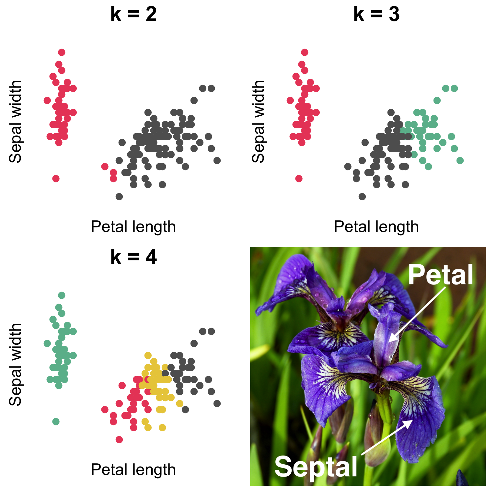
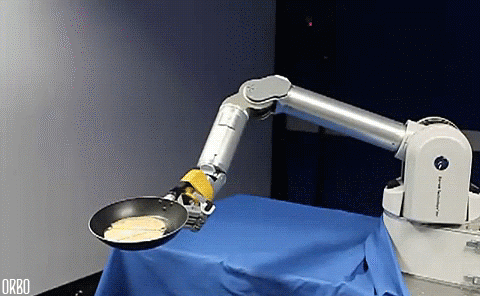
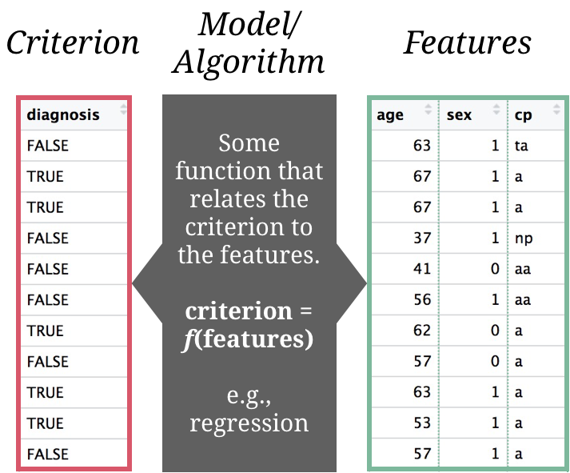
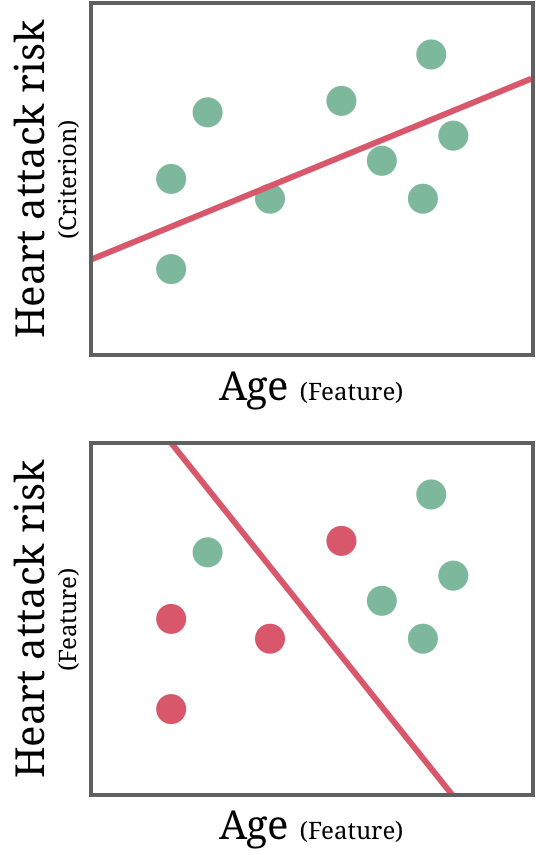
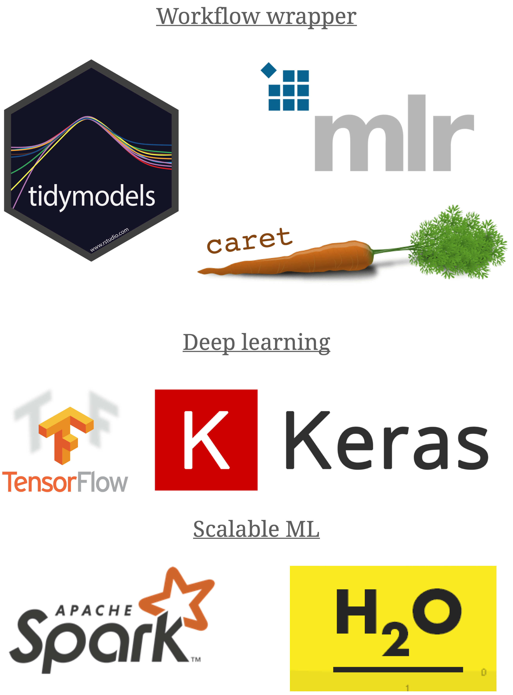
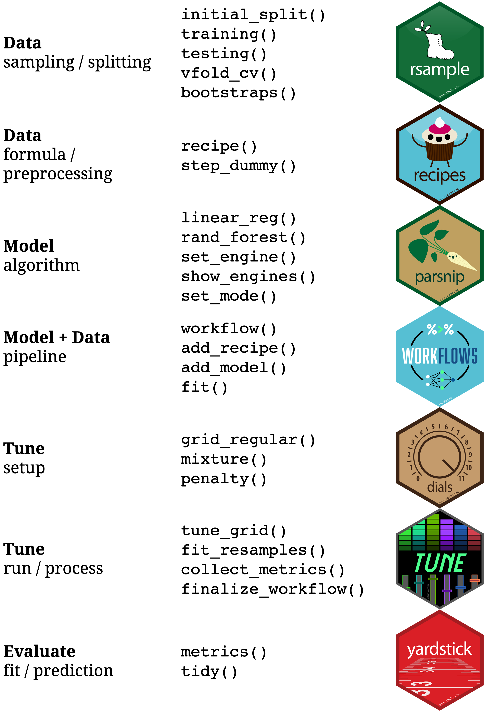

layout: true

<div class="my-footer">
  <span style="text-align:center">
    <span> 
      
    </span>
    <a href="https://therbootcamp.github.io/">
      <span style="padding-left:82px"> 
        <font color="#7E7E7E">
          www.therbootcamp.com
        </font>
      </span>
    </a>
    <a href="https://therbootcamp.github.io/">
      <font color="#7E7E7E">
       Applied Machine Learning with R | November 2021
      </font>
    </a>
    </span>
  </div> 

---

```{r setup, include=FALSE}
options(htmltools.dir.version = FALSE)
options(width=110)
options(digits = 4)
library(tidyverse)
#baselers <- read_csv("https://raw.githubusercontent.com/therbootcamp/baselers/master/inst/extdata/baselers.txt")
```


# What is machine learning?

.pull-left45[

]


.pull-right45[

<p align = "center">
<br>
<font style="font-size:10px">from <a href="https://medium.com/@dkwok94/machine-learning-for-my-grandma-ca242e97ef62">medium.com</a></font>
</p>


]

---

# What is machine learning?

.pull-left45[

<b>Machine learning is</b>...

<p style="padding-left:20px">

...a <high>field of artificial intelligence</high>...<br><br> 

...that uses <high>statistical techniques</high>... <br><br>

...to allow computer systems to <high>"learn"</high>,...<br><br>

...i.e., to progressively <high>improve performance</high> on a specific task...<br><br>

...from small or large amounts of <high>data</high>,... <br><br>

....<high>without being explicitly programmed</high>....<br><br>

....with the goal to <high>discover structure</high> or </high>improve decision making and predictions</high>.

</p>


]


.pull-right45[

<p align = "center">
<br>
<font style="font-size:10px">from <a href="https://medium.com/@dkwok94/machine-learning-for-my-grandma-ca242e97ef62">medium.com</a></font>
</p>


]


---

# Origin of ML 

<div align="center">
<iframe width="800" height="450" src="https://www.youtube.com/embed/cNxadbrN_aI?rel=0" frameborder="0" allow="accelerometer; autoplay; encrypted-media; gyroscope; picture-in-picture" allowfullscreen></iframe>
</div>


---

.pull-left3[

# Types of machine learning tasks


<ul>
  <li class="m1"><span>There are many types of machine learning tasks, each of which call for different models.</span></li>
  <li class="m2"><span><high>We will focus on supervised machine learning</high>.</span></li>
</ul>

]

.pull-right65[

<br><br>

<p align = "center">
<br>
<font style="font-size:10px">from <a href="image/mltypes.png">amazonaws.com</a></font>
</p>
]


---

# Unsupervised learning

.pull-left5[

<ul>
  <li class="m1"><span>Analyzes the relationships to <high>discover structures</high> such as groups or meta-features.</span></li>
  <ul class="level">
    <li><span><high>Clustering</high> - similarity between cases.</span></li>
    <li><span><high>Dimensionality reduction</high> - similarity between features.</span></li>
  </ul>
</ul>


<table style="cellspacing:0; cellpadding:0; border:none; padding-top:10px">

<tr>
  <td bgcolor="white">
    <b>Approach</b>
  </td>
  <td bgcolor="white">
    <b>Description</b>
  </td>  
  <td bgcolor="white">
    <b>Example</b>
  </td>  
</tr>
<tr>
  <td bgcolor="white">
    <i>Clustering</i>
  </td>
  <td bgcolor="white">
   Analyze distances between cases to identify <high>clusters of homogeneous cases</high>.
  </td>  
  <td bgcolor="white">
   Types of customers or patients.
  </td>  
</tr>
<tr>
  <td bgcolor="white">
    <i>Dimension-<br>ality reduction</i>
  </td>
  <td bgcolor="white">
   Analyze correlations between features to identify <high>higher order features</high>. 
  </td>  
  <td bgcolor="white">
   Dimensions of personality or user experience.
  </td>  
</tr>
</table>


]

.pull-right4[


<p align = "center" height=380px>
<br>
</p>

]


---

# Reinforcement learning

.pull-left5[

<ul>
  <li class="m1"><span><high>Learns iteratively</high> from minimal supervision provided by <high>performance feedback</high>.</span></li>
  <li class="m2"><span>RL is closely related to <high>psychological theories of learning</high>.</span></li>
</ul>

<u>Examples</u>

<table style="cellspacing:0; cellpadding:0; border:none;">
  <col width="30%">
  <col width="70%">
<tr>
  <td bgcolor="white">
    <b>Application</b>
  </td>
  <td bgcolor="white">
    <b>Description</b>
  </td>  
</tr>
<tr>
  <td bgcolor="white">
    <i>Model fitting</i>
  </td>
  <td bgcolor="white">
   Iteratively <high>change model parameters</high> to improve prediction.  
</tr>
<tr>
  <td bgcolor="white">
    <i>Robot movements</i>
  </td>
  <td bgcolor="white">
   Iteratively <high>change movement</high> patterns to increase pancake-catch probability.  
</tr>
<tr>
  <td bgcolor="white">
    <i>Games</i>
  </td>
  <td bgcolor="white">
   Iteratively <high>change controller input</high> patterns to improve Mario Kart racing time.  
</tr>
</table>

]

.pull-right4[

<p align = "center">
<br>
<font style="font-size:10px">from <a href="https://giphy.com/explore/reinforcement-learning">giphy.com</a></font>
</p>

<p align = "center">
<br>
<font style="font-size:10px">from <a href="https://blogs.nvidia.com/blog/2017/04/14/tensorkart-ai-mario-kart/">nvidia.com</a></font>
</p>

]


---

# Supervised learning

.pull-left5[

<ul>
  <li class="m1"><span><high>The <high>dominant type</high> of machine learning.</span></li>
  <li class="m2"><span>Supervised learning uses <high>labeled data</high> to learn <high>a model</high> that relates the criterion to the features.</span></li>
</ul>


]

.pull-right4[

<p align = "center">
<br>
</p>
]


---

# 2 types of supervised problems

.pull-left5[

There are two types of supervised learning problems typically can be approached <high>using the same model</high>.

<font style="font-size:24px"><b>Regression</b></font>

Regression problems involve the <high>prediction of a quantitative feature</high>. 

E.g., predicting the cholesterol level as a function of age. 

<font style="font-size:24px"><b>Classification</b></font>

Classification problems involve the <high>prediction of a categorical feature</high>.   

E.g., predicting the origin of chest pain as a function of age and heart attack risk. 


]

.pull-right4[

<p align = "center">
<br>
</p>

]

---

# Three supervised models

```{r, echo = FALSE}
knitr::include_graphics("image/models.png")
```


---

.pull-left4[

# ML in R

<ul>
  <li class="m1"><span>R has advanced tremendously with respect to ML.</span></li>
  <li class="m2"><span>There exist <high>powerful and user-friendly</high> tools for all ML steps and algorithms.</span></li>
</ul>


]

.pull-right5[

<p align = "center">
<br><br>
<br>
</p>

]


---

.pull-left4[

# tidymodels

<ul>
  <li class="m1"><span><mono>tidymodels</mono> is a new meta-package for tidy ML in R.</span></li>
  <li class="m2"><span>Multiple packages span every important step of ML.</span></li>
</ul>

<br>
<p align = "center">
<br>
<font style="font-size:10px">from <a href="https://www.tidymodels.org/packages/">tidymodels.org</a></font>
</p>

]

.pull-right5[

<p align = "center">
<br>
<br>
</p>

]


---

class: middle, center

<h1><a href=https://therbootcamp.github.io/AML_2021AMLD/index.html>Schedule</a></h1>
